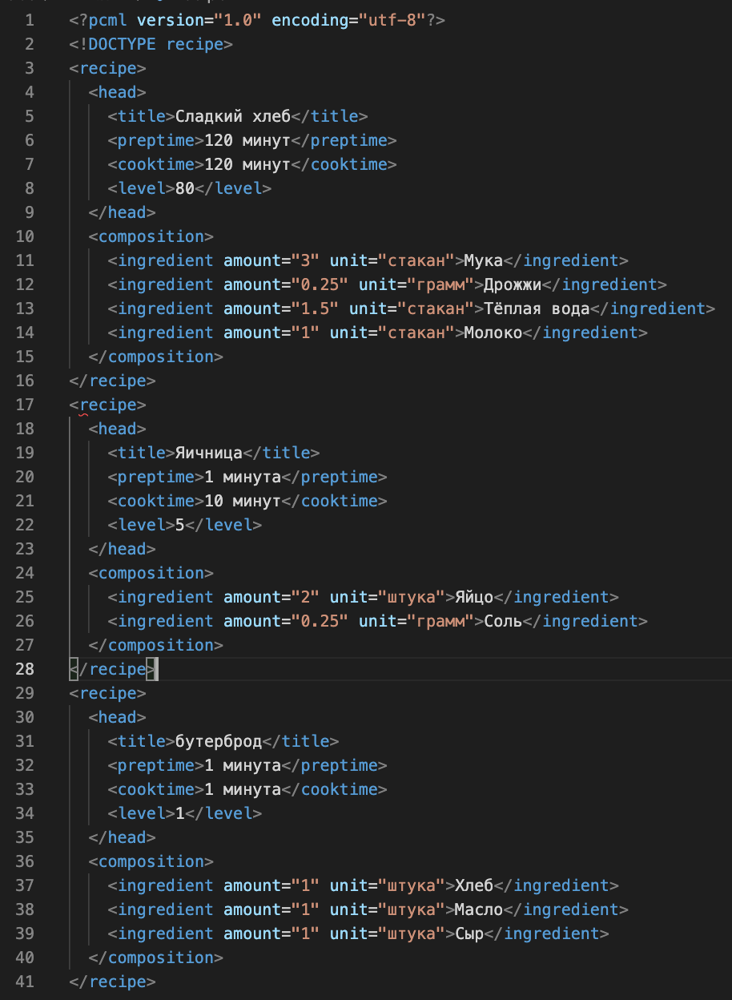

# Лабораторная работа 1

## Технологии создания XML-документов

### Задание

Создать xml файл валидной разметки с вложенностью не менее трёх уровней по теме согласно номеру студента в списке группы. Количество различных элементов второго уровня должно быть не менее двух. Количество различных элементов третьего уровня должно быть не менее четырёх. Тематика xml файла произвольная. Для каждого элемента первого уровня предусмотреть не менее 3 экземпляров, для каждого элемента последующих уровней – не менее двух экземпляров. Пример:
 

Привязать к XML файлу файл разметки CSS. Каждый элемент третьего уровня должен обладать своим стилем. Можно указывать цвет и фон текста, размер и стиль написания, шрифты, отступы и т.п.
Посмотреть результат в браузере.

### Варианты

|Номер варианта|Тема|
|-------|-----------|
|1|CRM система. Информация о поставщиках|
|2|Магазин игрушек|
|3|Netflix. Список фильмов|
|4|Магазин чая|
|5|Сервис продажи авиабилетов|
|6|Stack Overflow. Страница вопросов|
|7|Маркетплэйс. Страница конкретного товара|
|8|ВК. Группы|
|9|Букинг. Список отелей|
|10|Telegram. Данные сообщений|
|11|Банк. Данные о счетах|
|12|Кинотеатр. Бронирование билетов|
|13|Маркетплэйс. Витрина товаров|
|14|ВК. Приложения|
|15|Telegram. Данные чатов|
|16|Банк. Акции и предложения|
|17|Облако данных(диск). Загруженные файлы|
|18|Почта. Список писем|
|19|Магазин спорт товаров|
|20|CRM система. Информация о покупателях|
|21|CRM система. Отчёты о сделках|
|22|ВК. Новости|
|23|Магазин электроники|
|24|Сервис продажи жд билетов|

