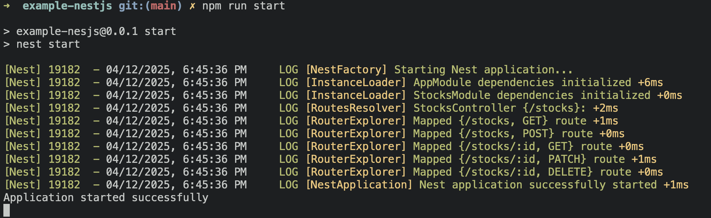
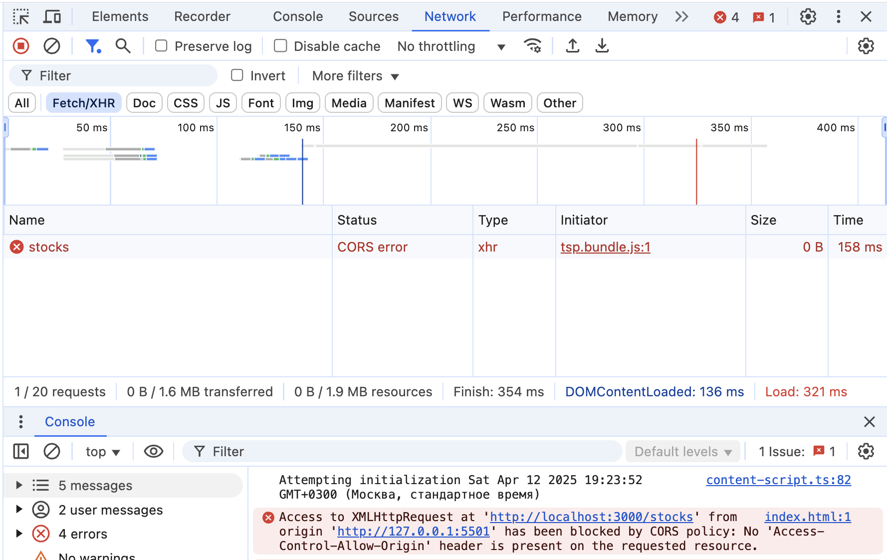
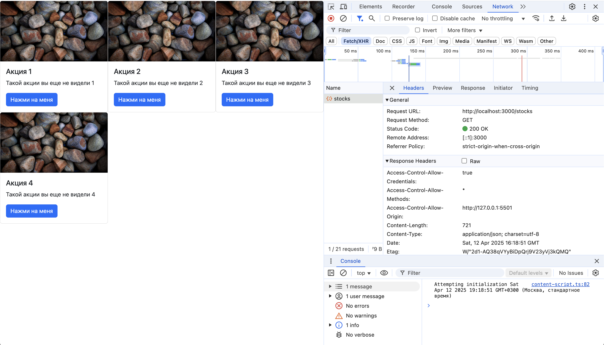
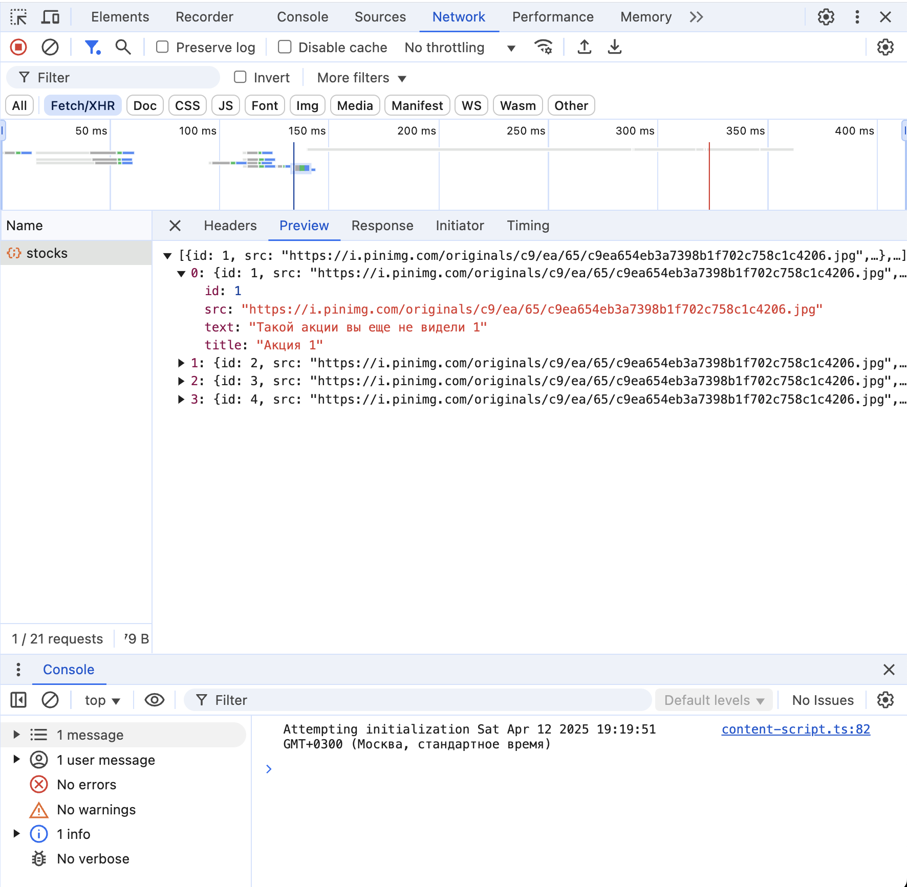
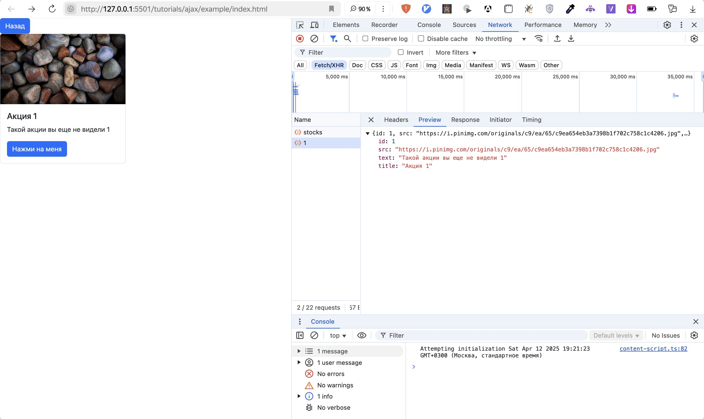

# ЛР №5. Простое веб-приложение. Работа с API.

**Цель** данной лабораторной работы - взаимодействие с внешним API через XMLHttpRequest. В ходе выполнения работы, вам предстоит ознакомиться с кодом реализации простого взаимодействия с внешним API, получение данных и вывод их в интерфейс пользователя, и затем выполнить задания по варианту.

## План лабораторной работы.

1. Инструменты для работы.
2. Что такое XMLHttpRequest.
3. Работа с API.
4. API главной страницы с карточками.
5. API страницы карточки.
6. Дополнительные материалы

## 1. Инструменты для работы.

Для работы будем использовать инструменты из предыдущих лабораторной работы: [VS Code](https://code.visualstudio.com/) + [Live Server](https://marketplace.visualstudio.com/items?itemName=ritwickdey.LiveServer).

## 2. Что такое XMLHttpRequest.

[XMLHttpRequest](https://developer.mozilla.org/en-US/docs/Web/API/XMLHttpRequest) (или XHR) позволяет делать HTTP-запросы к серверу из браузера без перезагрузки страницы.
Несмотря на наличие слова "XML" в названии, с помощью XHR можно работать с любыми типами данных, а не только с XML.
С помощью XML можно загружать/скачивать файл, отслеживать прогрусс и многое другое.

## 3. Работа с API.

Перед началом работы с API разберемся с тем, как мы это будем делать в нашем проекте.
Первое с чего стоит начать - создадим еще один слой, где будем держать все методы работы с API.

Сейчас структура проекта выглядит так

```bash
├── pages
├── components
├── index.html
├── main.js
```

Добавим еще один слой `modules`

```bash
├── pages
├── components
├── modules
├── index.html
├── main.js
```

### 3.1. Работа с урлами.

Для работы нам понадобятся эндпоинты API, разработанные в предыдущей ЛР. Запустим сервер с помощью `npm run start` и убедимся, что он заработал и готов слушать запросы. Сервер запустится и будет доступен по адресу `http://localhost:3000`.



Объявим нужные эндпоинты для карточек в отдельном файле, чтобы можно было переиспользовать в нескольких местах сразу и в случае чего, поменять базовый URL.

Базовый URL - `http://localhost:3000`, каждый запрос будет за карточками выполняться по `/stocks`.

-   Создаем файл `modules/stockUrls.js`

```js
class StockUrls {
    constructor() {
        this.baseUrl = 'http://localhost:3000';
    }

    getStocks() {
        return `${this.baseUrl}/stocks`;
    }

    getStockById(id) {
        return `${this.baseUrl}/stocks/${id}`;
    }

    createStock() {
        return `${this.baseUrl}/stocks`;
    }

    removeStockById() {
        return `${this.baseUrl}/stocks/${id}`;
    }

    updateStockById() {
        return `${this.baseUrl}/stocks/${id}`;
    }
}

export const stockUrls = new StockUrls();
```

Теперь, если нам нужно получить урл, то просто импортируем файл и получаем нужный нам урл.

```js
import { stockUrls } from './stockUrls.js';

stockUrls.getStocks();
```

### 3.2. Работа с API.

Мы будем работать с API через XHR. Для удобства создадим класс, в котором опишем методы для работы с API.

-   Создаем файл `modules/ajax.js`

```js
class Ajax {
    /**
     * GET запрос
     * @param {string} url - Адрес запроса
     * @param {function} callback - Функция обратного вызова (data, status)
     */
    get(url, callback) {
        const xhr = new XMLHttpRequest();
        xhr.open('GET', url);
        xhr.send();

        xhr.onreadystatechange = () => {
            if (xhr.readyState === 4) {
                this._handleResponse(xhr, callback);
            }
        };
    }

    /**
     * POST запрос
     * @param {string} url - Адрес запроса
     * @param {object} data - Данные для отправки
     * @param {function} callback - Функция обратного вызова (data, status)
     */
    post(url, data, callback) {
        const xhr = new XMLHttpRequest();
        xhr.open('POST', url);
        xhr.setRequestHeader('Content-Type', 'application/json');
        xhr.send(JSON.stringify(data));

        xhr.onreadystatechange = () => {
            if (xhr.readyState === 4) {
                this._handleResponse(xhr, callback);
            }
        };
    }

    /**
     * PATCH запрос
     * @param {string} url - Адрес запроса
     * @param {object} data - Данные для обновления
     * @param {function} callback - Функция обратного вызова (data, status)
     */
    patch(url, data, callback) {
        const xhr = new XMLHttpRequest();
        xhr.open('PATCH', url);
        xhr.setRequestHeader('Content-Type', 'application/json');
        xhr.send(JSON.stringify(data));

        xhr.onreadystatechange = () => {
            if (xhr.readyState === 4) {
                this._handleResponse(xhr, callback);
            }
        };
    }

    /**
     * DELETE запрос
     * @param {string} url - Адрес запроса
     * @param {function} callback - Функция обратного вызова (data, status)
     */
    delete(url, callback) {
        const xhr = new XMLHttpRequest();
        xhr.open('DELETE', url);
        xhr.send();

        xhr.onreadystatechange = () => {
            if (xhr.readyState === 4) {
                this._handleResponse(xhr, callback);
            }
        };
    }

    /**
     * Обработчик ответа (приватный метод)
     * @param {XMLHttpRequest} xhr - Объект запроса
     * @param {function} callback - Функция обратного вызова
     */
    _handleResponse(xhr, callback) {
        try {
            const data = xhr.responseText ? JSON.parse(xhr.responseText) : null;
            callback(data, xhr.status);
        } catch (e) {
            console.error('Ошибка парсинга JSON:', e);
            callback(null, xhr.status);
        }
    }
}

export const ajax = new Ajax();
```

У нас есть готовый класс, через который мы можем выполнять запросы. Тут уже происходит вся нужная обработка и формирование JSON объекта из данных и вызов коллбека.

```js
import { ajax } from './ajax.js';

// GET пример
api.get('https://api.example.com/data', (data, status) => {
    console.log(status, data);
});

// POST пример
api.post('https://api.example.com/create', { name: 'John' }, (data, status) => {
    console.log(status, data);
});

// PATCH пример
api.patch(
    'https://api.example.com/update/1',
    { name: 'Updated' },
    (data, status) => {
        console.log(status, data);
    }
);

// DELETE пример
api.delete('https://api.example.com/delete/1', (data, status) => {
    console.log(status, data);
});
```

## 4. API главной страницы с карточками.

Переведем нашу главную страницу на работу с API.
Сделаем так, чтобы на главной странице выводились карточки, полученные по API.

Первое с чего нужно начать - модифицировать получение данных.
Сейчас мы рисуем карточки на основе объекта в коде.
Нам нужно поменять на получение данных из API и отрисовку карточек.

-   Изменяем функцию получения данных

```js
import {ajax} from "../../modules/ajax.js";
import {stockUrls} from "../../modules/stockUrls.js";


getData() {
    ajax.get(stockUrls.getStocks(), (data) => {
        this.renderData(data);
    })
}
```

-   Добавляем функцию отрисовки карточек по данным

```js
renderData(items) {
    items.forEach((item) => {
        const productCard = new ProductCardComponent(this.pageRoot)
        productCard.render(item, this.clickCard.bind(this))
    })
}
```

-   Модифицируем функцию отрисовки страницы

```js
render() {
    this.parent.innerHTML = ''
    const html = this.getHTML()
    this.parent.insertAdjacentHTML('beforeend', html)

    this.getData()
}
```

---

Если вы все еще видите пустую страницу, то проверьте консоль разработчика - возможно, там будет ошибка:
`Access to XMLHttpRequest at 'http://localhost:3000/stocks' from origin 'http://127.0.0.1:5501' has been blocked by CORS policy: No 'Access-Control-Allow-Origin' header is present on the requested resource.`



При попытке выполнить XHR-запрос браузер может заблокировать запрос не с того же домена, на котором находится запрашиваемый ресурс. Такая политика ограничений называется [CORS](https://developer.mozilla.org/en-US/docs/Web/HTTP/Guides/CORS).

Есть несколько способов обойти это:

1. Сделать так, чтобы главная страница index.html располагалась на том же домене и порту, что и серверная часть приложения, к которой будут выполняться запросы.
2. Настроить CORS заголовки на сервере, чтобы они принимали запросы с конкретных или произвольных доменов.
3. Использовать расширение [CORS Unblock](https://chromewebstore.google.com/detail/cors-unblock/lfhmikememgdcahcdlaciloancbhjino), которое позволить обойти ограничения. Принцип работы расширения таков: оно перехватывает запрос и подменяет заголовки, убеждая браузер, что ответ пришел с разрешенного источника. CORS Unblock полезен для разработки, но не стоит использовать его в продакшене, так как он обходит встроенную защиту браузера. Лучший вариант — правильно настроить CORS на сервере.

Воспользуемся CORS Unblock, как самым быстрым и простым решением. После установки и включения расширения ошибка должна исчезнуть. Если этого не произошло, убедитесь, что все сделали правильно.

---

Теперь, на главной странице у нас отображаются все карточки, получаемые с бэкенда по API. Результаты запросов можно отследить в **DevTools** во вкладке **Network**.





Перейдем к модификации второй страницы.

## 5. API страницы карточки.

Модифицируем страницу так, чтобы отображать данные карточки, на которую нажали.

-   Изменяем функцию получения данных

```js
 getData() {
    ajax.get(stockUrls.getStockById(this.id), (data) => {
        this.renderData(data);
    })
}
```

-   Добавляем функцию отрисовки карточек по данным

```js
renderData(item) {
    const product = new ProductCardComponent(this.pageRoot)
    product.render(item)
}
```

-   Модифицируем функцию отрисовки страницы

```js
render() {
    this.parent.innerHTML = ''
    const html = this.getHTML()
    this.parent.insertAdjacentHTML('beforeend', html)

    const backButton = new BackButtonComponent(this.pageRoot)
    backButton.render(this.clickBack.bind(this))

    this.getData()
}
```

Теперь при переходе на страницу какой-то карточки ее данные будут приходить через API по сети. Убедимся в этом, посмотрев вкладку **Network**:



## Дополнительные материалы

#### 1 вариант.

1. Главная страница - получаем и отображаем список карточек
   Необходимо сделать компонент для фильтрации карточек по названию (title) с помощью передачи query-параметра в GET-запрос.

2. Вторая страница - отображение конкретной карточки по ID. Добавить кнопку удаления карточки и выполнять удаление при клике на нее через DELETE-запрос к API.

#### 2 вариант.

1. Главная страница - получаем и отображаем список карточек.

2. Вторая страница - добавить страницу с формой создания карточки и выполнять ее создание через POST-запрос.

#### 3 вариант.

1. Главная страница - получаем и отображаем список карточек.

2. Вторая страница - отображение конкретной карточки по ID. Добавить поля для обновления карточки и обновлять их с помощью PATCH-запроса.

#### 4 вариант.

1. Главная страница - получаем и отображаем список карточек.
   Необходимо сделать компонент для фильтрации карточек по названию (title) с помощью передачи query-параметра в GET-запрос.

2. Добавить поле для ввода числа, которое будет ограничивать максимальное количество карточек, отображаемых на странице - простенькая пагинация на клиенсткой части. При изменении этого числа, количество карточек должно меняться.
