# Методические указания по созданию бэкенда на Express.js

## План

1. Введение в Express.js
2. Сравнение Express.js с чистым Node.js и NestJS
3. Создание проекта и базовая настройка
4. Архитектура приложения
5. Реализация REST API для карточек `Stock`
6. Тестирование работоспособности сервиса с помощью `Postman`
7. Дополнительные материалы

## 1. Введение в Express.js

### Что такое Express.js

[Express.js](https://expressjs.com/) (или просто Express) — это минималистичный и гибкий веб-фреймворк для Node.js, предоставляющий мощный набор функций для быстрого создания веб-приложений и API.

В то время как встроенный модуль `http` в Node.js предоставляет низкоуровневые инструменты для работы с сервером, Express создает удобные абстракции над ним(маршрутизация, middleware, обработка ошибок). Это позволяет разработчикам фокусироваться на бизнес-логике приложения, а не на деталях обработки потоков данных и парсинге URL.

### Ключевые особенности

- **Минималистичность:** Express не навязывает жесткую архитектуру (в отличие от NestJS). Вы сами выбираете структуру папок и используемые библиотеки.
- **Middleware-архитектура:** В основе Express лежит концепция цепочки функций-обработчиков, через которые проходит запрос.
- **Роутинг:** Мощная система маршрутизации позволяет легко определять обработчики для различных URL и HTTP-методов (`GET /stocks`, `POST /stocks`, `GET /stocks/:id` и т.д.).
- **Производительность:** Благодаря своей легковесности, Express добавляет минимальный оверхед к базовой производительности Node.js.

## 2. Сравнение Express.js с чистым Node.js и NestJS

### Express.js vs Node.js (http)

Рассмотрим, как выглядит создание простого эндпоинта.

**Чистый Node.js:**
```js  
const http = require('http'); 

const server = http.createServer((req, res) => {  
    // Ручной парсинг URL и HTTP метода
    if (req.method === 'GET' && req.url === '/hello') {
	    res.writeHead(200, { 'Content-Type': 'application/json' });  
        res.end(JSON.stringify({ message: 'Hello World' }));
        return;
    }
    
	res.writeHead(404);  
    res.end('Not Found'); 
});  
```  

**Express.js:**
```js  
const express = require('express');
const app = express();  
  
// Декларативное описание маршрута  
app.get('/hello', (req, res) => {  
    res.json({ message: 'Hello World' });  
});  
```


**Ключевые отличия:**

| Функция              | Node.js (http)                                | Express.js                                              |
| -------------------- | --------------------------------------------- | ------------------------------------------------------- |
| **Маршрутизация**    | Ручная проверка `req.url` и `req.method`      | Методы `app.get()`,`app.post()`                         |
| **Параметры URL**    | Ручной парсинг параметров пути и query-string | Автоматически в `req.params`                            |
| **Отправка JSON**    | `res.setHeader` + `res.end(JSON.stringify())` | `res.json()`                                            |
| **Обработка тела**   | Ручное чтение потока (Stream)                 | Готовые middleware (`express.json()`)                   |
| **Обработка ошибок** | Ручная обработка через `try-catch`            | Готовые middleware для синхронных и асинхронных ошиброк |

### Express.js vs NestJS

Если Express — это набор инструментов, то NestJS — это полноценный "завод".

| Характеристика           | Express.js                                | NestJS                                  |
| ------------------------ | ----------------------------------------- | --------------------------------------- |
| **Архитектура**          | Гибкая (Library)                          | Строгая, модульная (Framework)          |
| **Язык**                 | JavaScript (обычно)                       | TypeScript (по умолчанию)               |
| **Dependency Injection** | Нет (ручное связывание)                   | Встроенный DI контейнер                 |
| **Абстракции**           | Работа напрямую с `req`/`res`             | Декораторы, Guards, Interceptors, Pipes |
| **Порог входа**          | Низкий                                    | Средний                                 |
| **Применение**           | Микросервисы, прототипы, простые API, MVP | Enterprise-системы, сложная логика      |

**Вывод:** Express идеален для понимания того, как работает веб-сервер "под капотом", и для создания легких сервисов. NestJS лучше подходит для крупных команд и проектов со сложной доменной логикой.

## 3. Создание проекта и базовая настройка

### Инициализация

Создадим папку проекта и инициализируем npm:

```shell  
mkdir example-express
cd example-express
npm init -y
```  

### Установка зависимостей

Установим сам фреймворк и утилиту `nodemon` для удобной разработки (автоматический перезапуск сервера при изменениях кода):

```shell  
npm install express
npm install --save-dev nodemon
```  

Добавим скрипты запуска в `package.json`:

```json  
{  
  "scripts": {  
    "start": "node src/index.js",  
    "dev": "nodemon src/index.js"  
  }
}  
```

Создадим `src/index.js`:

```js
const express = require('express');

const app = express();
const PORT = 3000;

app.use(express.json());

app.get('/', (req, res) => {
  res.send('Express сервер работает!');
});

app.listen(PORT, () => {
  console.log(`Сервер запущен по адресу http://localhost:${PORT}`);
});
```

Запуск:

```shell
npm run dev
```

Проверка в браузере `http://localhost:3000`:

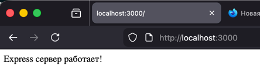

### Создание проекта (TypeScript)

Если хотите писать Express с типизацией (как в примере NestJS), можно настроить TypeScript:

```shell
npm install express
npm install -D typescript ts-node @types/express @types/node
npx tsc --init
```

Рекомендуемые параметры `tsconfig.json`:

```json
{
  "compilerOptions": {
    "target": "ES2020",              // Целевая версия JavaScript для компиляции
    "module": "commonjs",             // Система модулей (для Node.js используется CommonJS)
    "rootDir": "./src",               // Корневая директория исходных файлов TypeScript
    "outDir": "./dist",               // Директория для скомпилированных JavaScript файлов
    "strict": true,                   // Включает все строгие проверки типов
    "resolveJsonModule": true,        // Разрешает импорт JSON-файлов
    "esModuleInterop": true           // Совместимость ES модулей с CommonJS
  }
}
```

Скрипты в `package.json`:

```json
{
  "scripts": {
    "start": "node dist/index.js",
    "dev": "ts-node src/index.ts",
    "build": "tsc",
    "watch": "tsc --watch src/index.ts"
  }
}
```

> Отличие от NestJS: в Express нет CLI-генераторов модулей/контроллеров/сервисов “из коробки” — структуру проекта вы задаете сами.

## 4. Архитектура приложения

### Структура проекта

Хотя Express не навязывает структуру, для чистоты кода мы будем придерживаться **Layered Architecture** (Слоистой архитектуры), разделяя ответственность между компонентами. Это упростит возможный будущий переход на NestJS.

```  
example-express/  
├── src/  
│   ├── index.js              # Точка входа (Server setup)  
│   ├── routes/               # Маршруты (Router layer)  
│   │   └── stocks.js  
│   ├── controllers/          # Обработка запросов (Controller layer)  
│   │   └── stocksController.js  
│   ├── services/             # Бизнес-логика (Service layer)  
│   │   ├── stocksService.js  
│   │   └── fileService.js  
│   └── data/                 # Хранение данных  
│       └── stocks.json  
├── package.json  
└── package-lock.json  
```  

В Express приложении поток данных обычно выглядит так:

1.  **Request** попадает в `index.js`.
2.  Проходит через глобальные **Middleware** (логирование, парсинг JSON).
3.  Попадает в соответствующий **Router** (`routes/`).
4.  Роутер вызывает функцию из **Controller** (`controllers/`).
5.  Контроллер валидирует данные и вызывает метод **Service** (`services/`).
6.  Сервис выполняет бизнес-логику (чтение БД/файла) и возвращает данные.
7.  Контроллер отправляет **Response** клиенту.

Это очень похоже на архитектуру NestJS, но без использования классов и декораторов, а на простых функциях и модулях.

Схема взаимодействия в общем виде:

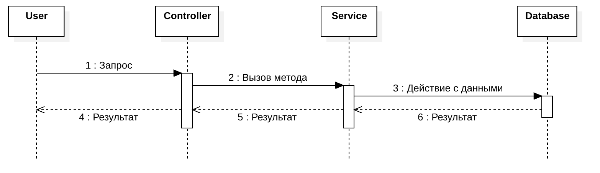

Схема взаимодействия в данной ЛР:


## Middleware — основа Express

**Middleware** — это функции, которые имеют доступ к объектам запроса (`req`), ответа (`res`) и следующей middleware-функции (`next`). Middleware выполняются **в порядке подключения**.

Пример access log middleware - логируем время, метод и эндпоинт на который пришёл запрос
```js
app.use((req, res, next) => {
  console.log(`[${new Date().toISOString()}] ${req.method} ${req.path}`);
  next();
});
```

Типовые middleware:

- **Встроенные**: `express.json()`, `express.urlencoded()`, `express.static()`
- **Router-level**: `router.use(...)`
- **Обработка ошибок** (4 аргумента): `(err, req, res, next) => {}`

Порядок важен:

1. парсеры (`express.json`, `express.urlencoded`)
2. собственные middleware (логирование, auth, и т.д.)
3. маршруты
4. обработчик 404
5. error handler (**в самом конце**)

### Роутинг и `express.Router()`

Express позволяет группировать маршруты в отдельные роутеры:

```js
const express = require('express');
const router = express.Router();

router.get('/', (req, res) => res.json([]));
router.get('/:id', (req, res) => res.json({ id: req.params.id }));

module.exports = router; // Экспортируем роутер для использования в других модулях
```

И подключать их:

```js
app.use('/stocks', stocksRouter); // Подключаем роутер к базовому пути /stocks
```

## 5. Реализация REST API для карточек `Stock`

#### **Задача** — разработать REST API сервис карточек c методами:

- GET `/stocks/` — получение всех карточек
- POST `/stocks` — создание новой карточки
- GET `/stocks/:id` — получение карточки по ID
- PATCH `/stocks/:id` — обновление карточки по ID
- DELETE `/stocks/:id` — удаление карточки по ID

### Шаг 1: Данные (JSON-файл)

В полноценных приложениях для хранения данных используются **БД** (**базы данных**). Упрощенный вариант - использовать файл. `src/data/stocks.json` содержит массив объектов-карточек:

```json
[
  {
    "id": 1,
    "src": "https://i.pinimg.com/originals/c9/ea/65/c9ea654eb3a7398b1f702c758c1c4206.jpg",
    "title": "Акция 1",
    "text": "Такой акции вы еще не видели 1"
  },
  {
    "id": 2,
    "src": "https://i.pinimg.com/originals/c9/ea/65/c9ea654eb3a7398b1f702c758c1c4206.jpg",
    "title": "Акция 2",
    "text": "Такой акции вы еще не видели 2"
  },
  {
    "id": 3,
    "src": "https://i.pinimg.com/originals/c9/ea/65/c9ea654eb3a7398b1f702c758c1c4206.jpg",
    "title": "Акция 3",
    "text": "Такой акции вы еще не видели 3"
  },
  {
    "id": 4,
    "src": "https://i.pinimg.com/originals/c9/ea/65/c9ea654eb3a7398b1f702c758c1c4206.jpg",
    "title": "Акция 4",
    "text": "Такой акции вы еще не видели 4"
  }
]
```

### Шаг 2: FileService (Слой данных)

Хорошей практикой является **инкапсуляция** взаимодействия с файловой системой в отдельный сервис. Создадим переиспользуемый сервис для чтения/записи файлов `src/services/fileService.js`, главная задача которого предоставить публичные методы `readData` и `writeData` для работы с файлом. Путь к файлу передается через параметр при вызове функций:

```js
const fs = require('fs');

const readData = (filePath) => {
    try {
        const data = fs.readFileSync(filePath, 'utf8');
        return JSON.parse(data);
    } catch (err) {
        console.error('Ошибка чтения файла:', err);
        return [];
    }
};

const writeData = (filePath, data) => {
    try {
        fs.writeFileSync(filePath, JSON.stringify(data, null, 2), 'utf8');
    } catch (err) {
        console.error('Ошибка записи файла:', err);
    }
};

module.exports = {
    readData,
    writeData
};
```

### Шаг 3: StocksService (Слой бизнес-логики)

Здесь находится логика фильтрации и управления массивом данных. `src/services/stocksService.js`:

```js
const fileService = require('./fileService');

// Переменная для хранения пути к файлу данных, будет установлена при инициализации
let dataFilePath;

// Функция инициализации сервиса с путем к файлу данных
const init = (filePath) => {
    dataFilePath = filePath;
};

const findAll = (title) => {
    const stocks = fileService.readData(dataFilePath);
    if (title) {
        return stocks.filter(stock => 
            stock.title.toLowerCase().includes(title.toLowerCase())
        );
    }
    return stocks;
};

const findOne = (id) => {
    const stocks = fileService.readData(dataFilePath);
    return stocks.find(stock => stock.id === id);
};

const create = (stockData) => {
    const stocks = fileService.readData(dataFilePath);
    
    // Генерация ID: берем максимальный ID + 1
    const newId = stocks.length > 0 
        ? Math.max(...stocks.map(s => s.id)) + 1 
        : 1;
        
    const newStock = { id: newId, ...stockData };
    stocks.push(newStock);
    fileService.writeData(dataFilePath, stocks);
    
    return newStock;
};

const update = (id, stockData) => {
    const stocks = fileService.readData(dataFilePath);
    const index = stocks.findIndex(s => s.id === id);
    
    if (index === -1) return null;
    
    stocks[index] = { ...stocks[index], ...stockData };
    fileService.writeData(dataFilePath, stocks);
    
    return stocks[index];
};

const remove = (id) => {
    const stocks = fileService.readData(dataFilePath);
    const filteredStocks = stocks.filter(s => s.id !== id);
    
    if (filteredStocks.length === stocks.length) {
        return false; // Ничего не удалили
    }
    
    fileService.writeData(dataFilePath, filteredStocks);
    return true;
};

module.exports = { init, findAll, findOne, create, update, remove };
```

**Сервис** содержит бизнес-логику определенного домена приложения. В данном случае он работает с карточками. Его задача заключается в манипуляциях с данными из файла (или базы данных в общем случае) и возврат результата на более высокий уровень - в контроллер.

в NestJS зависимости обычно внедряются через DI (Dependency Injection). В Express сервисы, как правило, подключаются через require/import и создаются “вручную”.

### Шаг 4: StocksController (Слой обработки запросов)

Контроллер принимает `req`, `res`, извлекает данные и вызывает сервис. Обратите внимание: здесь мы вручную управляем HTTP-статусами.
`src/controllers/stocksController.js`:

```js
const stocksService = require('../services/stocksService');

const getAllStocks = (req, res) => {
    const { title } = req.query;
    const stocks = stocksService.findAll(title);
    res.json(stocks);
};

const getStockById = (req, res) => {
    const id = parseInt(req.params.id);
    const stock = stocksService.findOne(id);
    
    if (!stock) {
        return res.status(404).json({ error: 'Карточка не найдена' });
    }
    
    res.json(stock);
};

const createStock = (req, res) => {
    const { src, title, text } = req.body;
    
    // Простая валидация
    if (!src || !title || !text) {
        return res.status(400).json({ error: 'Не все поля заполнены' });
    }
    
    const newStock = stocksService.create({ src, title, text });
    res.status(201).json(newStock);
};

const updateStock = (req, res) => {
    const id = parseInt(req.params.id);
    const updatedStock = stocksService.update(id, req.body);
    
    if (!updatedStock) {
        return res.status(404).json({ error: 'Карточка не найдена' });
    }
    
    res.json(updatedStock);
};

const deleteStock = (req, res) => {
    const id = parseInt(req.params.id);
    const success = stocksService.remove(id);
    
    if (!success) {
        return res.status(404).json({ error: 'Карточка не найдена' });
    }
    
    res.status(204).send(); // 204 No Content
};

module.exports = {
    getAllStocks,
    getStockById,
    createStock,
    updateStock,
    deleteStock
};
```

**Контроллер** является связующим звеном между пользователем и сервисом бизнес-логики. При обработке запроса **контроллер** обращается к соответствующему сервису(ам). Также в обязанности **контроллера** могут входить такие задачи, как: анализ параметров запроса, возврат пользователю определенных кодов ошибок и т.д. В приложении может быть N **контроллеров**.


### Шаг 5: Routes (Маршрутизация)

Связываем URL с методами контроллера.
`src/routes/stocks.js`:

```js
const express = require('express');
const router = express.Router();
const stocksController = require('../controllers/stocksController');

// Определение маршрутов
router.get('/', stocksController.getAllStocks);
router.get('/:id', stocksController.getStockById);
router.post('/', stocksController.createStock);
router.patch('/:id', stocksController.updateStock);
router.delete('/:id', stocksController.deleteStock);

module.exports = router;
```

### Шаг 6: Подключение маршрутов и обработка ошибок(Entry Point)

Собираем все вместе в `src/index.js`:

```js
const express = require('express');
const path = require('path');
const stocksRouter = require('./routes/stocks');
const stocksService = require('./services/stocksService');

const app = express();
const PORT = 3000;

// Определяем путь к файлу данных
const DATA_FILE_PATH = path.join(__dirname, 'data/stocks.json');

// Инициализируем сервис с путем к файлу данных
stocksService.init(DATA_FILE_PATH);

// 1. Встроенный middleware для парсинга JSON
app.use(express.json());

// 2. Логирующий middleware
app.use((req, res, next) => {
    console.log(`[${new Date().toISOString()}] ${req.method} ${req.url}`);
    next(); // Обязательно вызываем next(), иначе запрос зависнет
});

// 3. Подключение маршрутов
app.use('/stocks', stocksRouter);

// 4. Глобальная обработка 404
app.use((req, res) => {
    res.status(404).json({ error: 'Маршрут не найден' });
});

// error handler
app.use((err, req, res, next) => {
    console.error(err);
    res.status(500).json({ error: 'Внутренняя ошибка сервера' });
});

// 5. Запуск сервера
app.listen(PORT, () => {
    console.log(`Сервер запущен по адресу http://localhost:${PORT}`);
});
```

## 6. Тестирование работоспособности сервиса с помощью `Postman`

Для тестирования эндпоинтов удобно использовать [Postman](https://www.postman.com/downloads/) (или `curl`).

### Запуск приложения

```shell
npm run start
```

Если запуск прошел успешно, видим логи:

```
npm run start

> example-expressjs@1.0.0 start
> node src/index.js

Сервер запущен по адресу http://localhost:3000
[2026-02-07T16:33:15.197Z] GET /stocks
[2026-02-07T16:33:18.236Z] GET /stocks/1
```

### GET /stocks/ — получение всех карточек

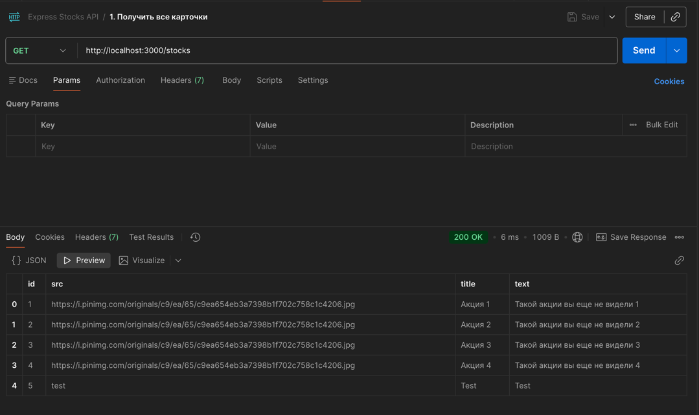

### GET /stocks?title=Акция 1 — поиск по названию


### POST /stocks — создание новой карточки

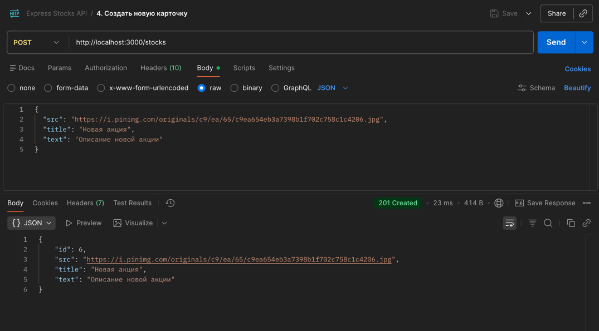

Проверяем, что карточка появилась:

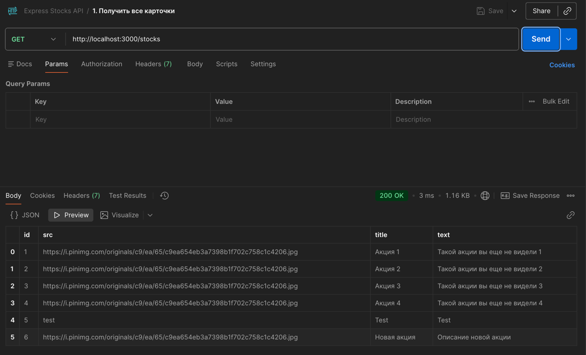

### GET /stocks/:id — получение карточки по ID

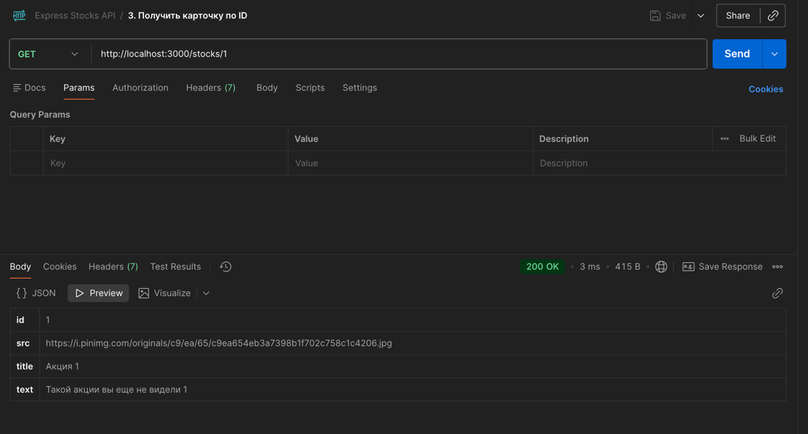

### PATCH /stocks/:id — обновление карточки

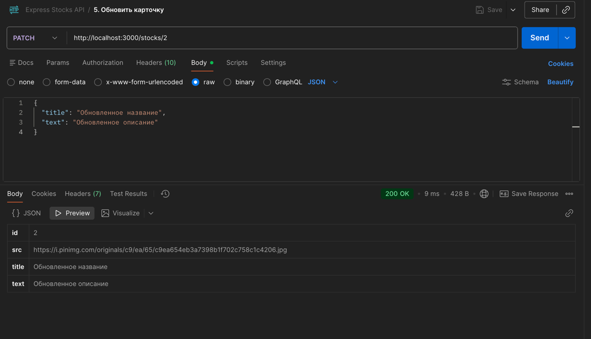

Проверяем результат:

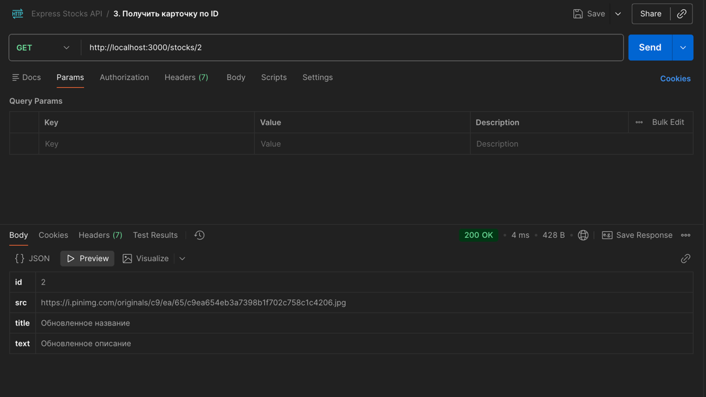

### DELETE /stocks/:id — удаление карточки

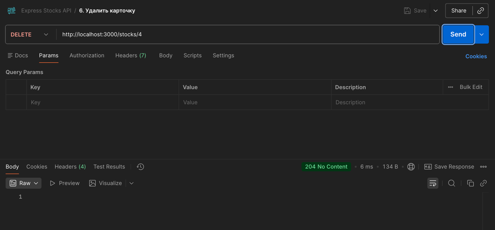

Проверяем удаление:

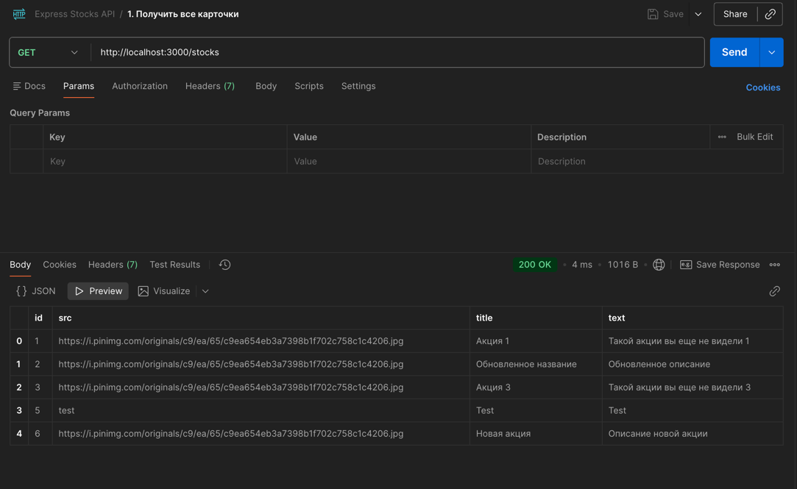

### Итоговая структура проекта

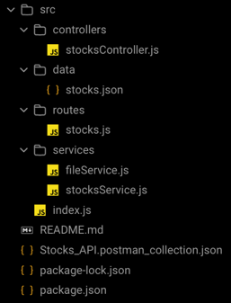

## 7. Дополнительные материалы

### Полезные middleware / библиотеки для Express

- **[`morgan`](https://www.npmjs.com/package/morgan)** — логирование HTTP запросов
- **[`cors`](https://www.npmjs.com/package/cors)** — настройка CORS
- **[`helmet`](https://www.npmjs.com/package/helmet)** — безопасность HTTP заголовков
- **[`joi`](https://www.npmjs.com/package/joi)** или **[`express-validator`](https://www.npmjs.com/package/express-validator)** — валидация данных
- **[`bcryptjs`](https://www.npmjs.com/package/bcryptjs)** — хеширование паролей
- **[`jsonwebtoken`](https://www.npmjs.com/package/jsonwebtoken)** — JWT аутентификация
- **[`dotenv`](https://www.npmjs.com/package/dotenv)** — переменные окружения
- **[`sequelize`](https://www.npmjs.com/package/sequelize)** или **[`prisma`](https://www.npmjs.com/package/prisma)** — ORM для работы с БД

### Примеры установки

```shell
npm install morgan cors helmet joi bcryptjs jsonwebtoken
npm install -D @types/morgan @types/cors
```
### Варианты доп. заданий на выбор

- Реализовать централизованную [обработку ошибок](https://expressjs.com/en/guide/error-handling.html) через error-handling middleware и добавить валидацию данных с помощью [`express-validator`](https://express-validator.github.io/docs/) или [`joi`](https://joi.dev/api/);
- Добавить документацию API через [Swagger/OpenAPI](https://swagger.io/docs/specification/about/) с использованием [`swagger-ui-express`](https://www.npmjs.com/package/swagger-ui-express) и [`swagger-jsdoc`](https://www.npmjs.com/package/swagger-jsdoc);
- Подключить базу данных с помощью ORM [`Sequelize`](https://sequelize.org/docs/v6/getting-started/) или [`Prisma`](https://www.prisma.io/docs/getting-started);
- Добавить передачу данных в реальном времени через [WebSocket](https://developer.mozilla.org/en-US/docs/Web/API/WebSockets_API) с использованием библиотеки [`ws`](https://www.npmjs.com/package/ws) или [`socket.io`](https://socket.io/docs/v4/);
- Добавить unit / integration / end-to-end [тестирование](https://mochajs.org/) с использованием [`mocha`](https://mochajs.org/) + [`chai`](https://www.chaijs.com/), [`jest`](https://jestjs.io/docs/getting-started) или [`supertest`](https://www.npmjs.com/package/supertest) для API тестов;
- Настроить [CORS](https://expressjs.com/en/resources/middleware/cors.html) для работы с фронтенд-приложениями и добавить security headers через [`helmet`](https://helmetjs.github.io/);
- Реализовать [rate limiting](https://www.npmjs.com/package/express-rate-limit) для защиты API от злоупотреблений и DDoS-атак;
- Добавить [логирование](https://expressjs.com/en/guide/debugging.html) запросов с помощью [`morgan`](https://www.npmjs.com/package/morgan) и структурированное логирование через [`winston`](https://www.npmjs.com/package/winston) или [`pino`](https://getpino.io/);

## Заключение
- Express — это **не отдельный язык и не отдельный сервер**: это библиотека, которая упрощает написание HTTP API на Node.js.
- Express не “ускоряет” Node.js в плане вычислений — он ускоряет **разработку** за счет удобного API и экосистемы middleware.
- Основные преимущества Express это простота и минимализм, гибкость в организации кода и множество готовых middleware и библиотек, которые существенно ускоряют разработку.
