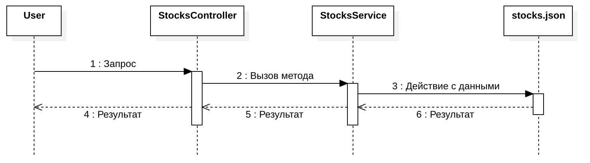
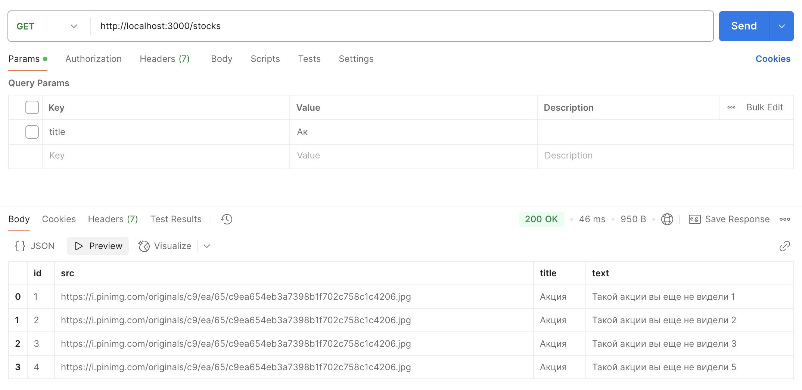
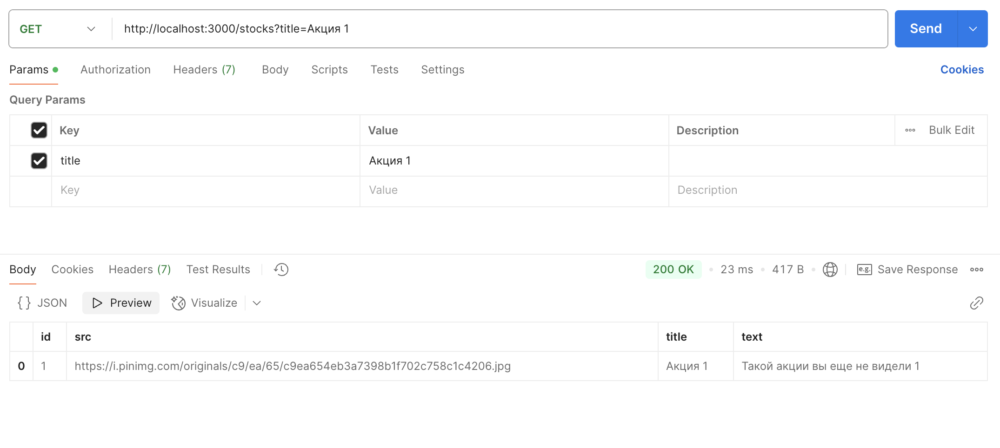
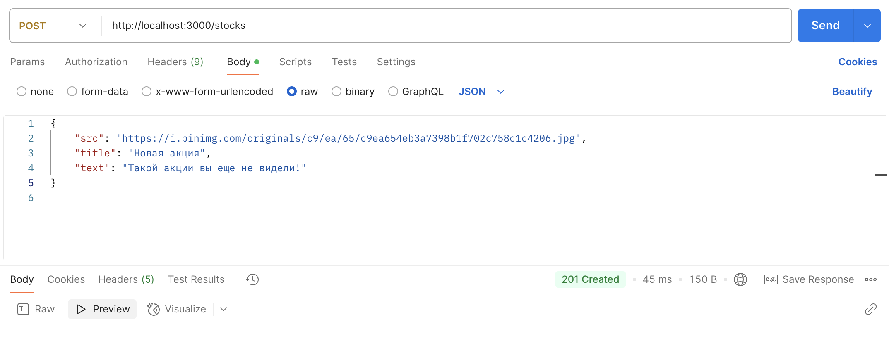
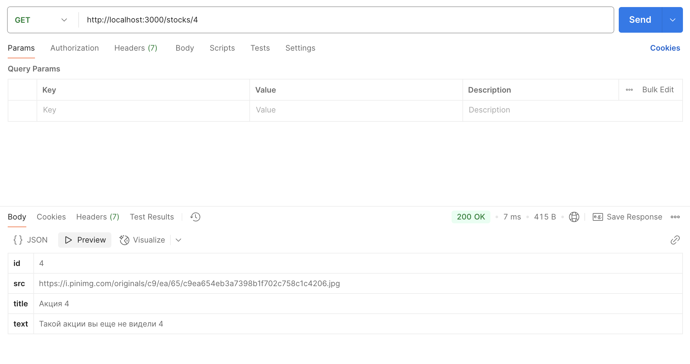
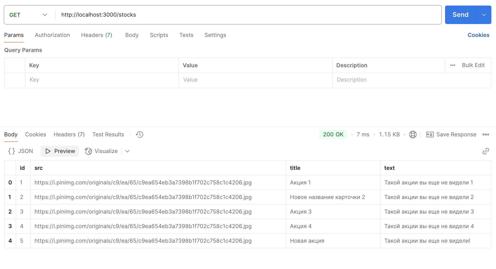
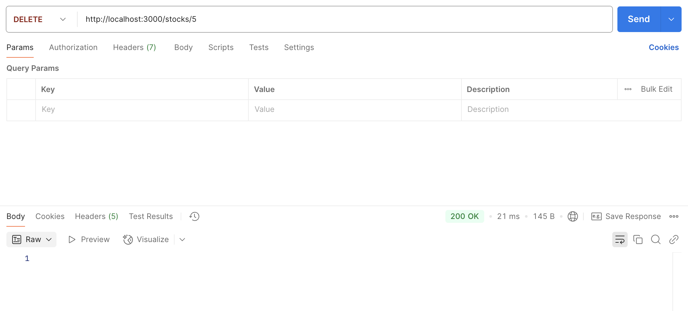
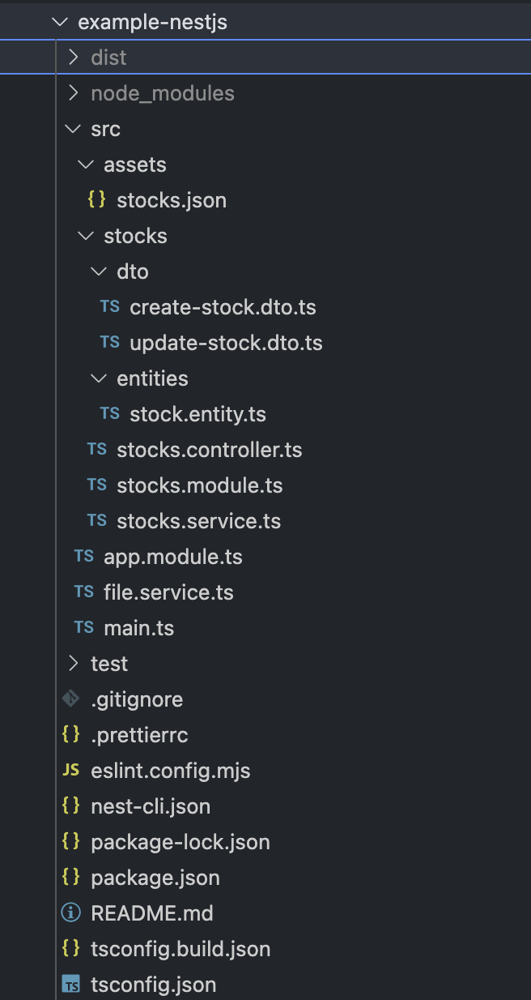

# Методические указания по созданию бэкенда на NestJS

## План

1. Введение в Node.js
2. Пишем API с использованием внутреннего пакета http.
3. Пишем API на NestJS.
4. Реализация интерфейса карточки `Stock` и методов классов, работающих с карточками.
5. Тестирование работоспособности сервиса с помощью `Postman`.
6. Дополнительные материалы

## 1. Введение в Node.js

### Что такое Node.js

Node.js (Node) — это платформа с открытым исходным кодом для работы с языком JavaScript построенная на движке Chrome V8. Она позволяет писать серверный код для веб-приложений и динамических веб-страниц, а также программ командной строки. В основе платформы — событийно-управляемая модель с неблокирующими операциями ввода-вывода, что делает ее эффективной и легкой.

### Главный минус Node.js

Безусловно на Node.js достаточно быстро можно писать различные серверные приложения/сервисы, но все это будет упираться в низкой производительности. Node.js однопоточна, это его главный минус, поэтому для решения задач хайлоада, нода не подойдет.

### Возможности Node.js и способы применения в production-среде

-   **Веб-серверы:**  
    Node.js широко используется для создания как простых, так и высоконагруженных веб-приложений. Например, такие компании, как Netflix, LinkedIn и Walmart, используют Node.js для серверной части своих приложений.
    
-   **API-серверы:**  
    Благодаря легкой интеграции с Express и Fastify, Node.js является отличным выбором для построения RESTful и GraphQL API.
    
-   **Реализация real-time приложений:**  
    Использование WebSocket и библиотек, таких как Socket.IO, позволяет создавать чаты, системы уведомлений и онлайн-игры с мгновенной синхронизацией.
    
-   **Потоковая обработка данных:**  
    Применяется для работы с потоками данных (stream processing), например, в видеостриминге или аналитических системах.
    
-   **Десктопные приложения:**  
    С помощью Electron можно создавать кросс-платформенные десктопные приложения, такие как Visual Studio Code и Slack.
    
-   **Мобильные приложения:**  
    Node.js интегрируется с React Native для разработки мобильных приложений с общей кодовой базой для iOS и Android.
    
-   **Приложения для смарт-ТВ:**  
    Использование Svelte и Node.js позволяет разрабатывать интерфейсы для телевизионных платформ и мультимедийных устройств. Компания Smart использует Svelte для написания приложений под Smart TV.
    
-   **Serverless-архитектура:**  
    Node.js отлично подходит для выполнения функций в рамках платформ FaaS (Function as a Service), таких как AWS Lambda, Google Cloud Functions и Azure Functions.
    
-   **Микросервисы:**  
    Использование Node.js упрощает создание независимых компонентов приложения, которые могут масштабироваться и обновляться автономно.
    
-   **DevOps и утилиты:**  
    Node.js активно используется для автоматизации задач разработки и деплоя, например, через инструменты типа Gulp и Webpack.

### Примеры скриптов на Node.js

Рассмотрим несколько примеров скриптов, чтобы поподробнее посмотреть, как именно работает Node.js.

```js
const {writeFileSync, readFileSync} = require('fs');
const path = require('path');

function doMusic() {
	return 'listen to radiohead, guys';
}

writeFileSync(path.join(__dirname, 'wisdom-book.txt'), doMusic());
```

Как мы видим синтаксис идентичен синтаксису обычного javascript.
В Node.js используется модульная система CommonJS. Подробнее про модульные системы можно почитать [здесь](https://habr.com/ru/company/nix/blog/261141/).

Еще пример:

```js
const readline = require('readline');

const rl = readline.createInterface({
  input: process.stdin,
  output: process.stdout,
  terminal: false
});

function countNumbers(str){
    let count = 0;
    for (let i = 0; i < str.length; ++i) {
        if (!Number.isNaN(Number.parseInt(str))) {
            count++;
        }
    }

    return count;
}


rl.once('line', (line) => {
    console.log(countNumbers(line));

    rl.close();
});
```

Скрипт выше принимает строку из ввода консоли и выводит сколько в ней цифр.

У Node.js большое число встроенных библиотек, в примере выше мы видим библиотеку `readline` для работы с вводом/выводом.
В предыдущем примеры мы использовали библиотеку `fs` для работы с файловой системой.

## 2. Пишем API с использованием внутреннего пакета http

В Node.js есть стандартная библиотека для написания http-сервера.

Создадим файл `server.js` и подключим библиотеку
```js
// /server.js
const http = require("http");
```

Далее в переменных объявляем на каком хосте и порте будет крутиться наш сервер.
В данном случае это наш локальный адрес и 8000 порт:
```js
// /server.js
const HOST = 'localhost';
const PORT = 8000;
```

Теперь объявим функцию, которая будет принимать запросы и отправлять ответы.
У этой функции есть определенный формат: принимает два аргумента `req` - http-запрос, `res` - http-ответ.
В примере внизу наш обработчик на любой запрос отдает статус `200 ОК` и в теле ответ `JavaScript - классный язык программирования!`.
```js
// /server.js
const handler = (req, res) => {
    res.writeHead(200);
    res.end('JavaScript - классный язык программирования!');
};
```

Наконец объявим сервер и заиспользуем созданные нами функцию и переменные:
```js
// /server.js
const server = http.createServer(handler);
server.listen(PORT, HOST, () => {
    console.log(`Сервер запущен по адресу http://${host}:${port}`);
});
```

Итого получаем скрипт:

```js
// /server.js
const http = require("http");

const HOST = 'localhost';
const PORT = 8000;

const handler = (req, res) => {
    res.writeHead(200);
    res.end('JavaScript - классный язык программирования!');
};

const server = http.createServer(handler);
server.listen(PORT, HOST, () => {
    console.log(`Сервер запущен по адресу http://${host}:${port}`);
});
```

Запускаем наш сервер командой:

```shell
node server.js
```

Видим, в консоли вывод:

`Сервер запущен по адресу http://localhost:8000`

И далее консоль зависает. В этом процессе начинает бесконечно слушать подключения наш http-сервер.
Откроем новое окно консоли (не закрывая предыдущее) и пишем:

```shell
curl http://localhost:8000
```

И видим ответ:
```shell
JavaScript - классный язык программирования!
```

Поздравляю! Вы написали свой http-сервер на node.js.

## 3. Пишем API на NestJS

При реализации API крупных приложений применяют высокоуровневые фреймворки, которые ускоряют процесс разработки, упрощают работу с кодом и облегчают поддержку проекта на дистанции. Одним из популярных серверных JavaScript-фреймворков является NestJS.

[NestJS](https://docs.nestjs.com/) - мощный фреймворк для создания серверных приложений на NodeJS с полной поддержкой TypeScript, предоставляющий готовую модульную архитектуру приложений. Также NestJS предоставляет DI ([dependency injection](https://habr.com/ru/articles/350068/)) систему, которая позволяет гибко конфигурировать приложения.

#### **Задача** - разработать [REST API](https://habr.com/ru/articles/483202/) сервис карточек:

-   GET /stocks/ - получение всех карточек
-   POST /stocks - создание новой карточки
-   GET /stocks/:id - получение карточки по ID
-   PATCH /stocks/:id - обновление карточки по ID
-   DELETE /stocks/:id - удаление карточки по ID

#### **Шаги**:

Разработка сервиса карточек. Часть 1:
1. [Создание](https://docs.nestjs.com/first-steps) нового NestJS приложения.
2. [Генерация](https://docs.nestjs.com/recipes/crud-generator) нового CRUD-источника.
3. Реализация класса `FileService` для считывания и записи данных в json-файл.
4. Реализация интерфейса карточки `Stock`: реализация `GET` метода получения всех записей.
5. Тестирование `GET` метода с помощью [Postman](https://www.postman.com/).

Разработка сервиса карточек. Часть 2:
1. Доработка интерфейса карточки `Stock`: реализация остальных методов.
2. Тестирование остальных методов с помощью [Postman](https://www.postman.com/).

### Часть 1: 1. Установка CLI для NestJS и создание нового приложения:

```shell
npm i -g @nestjs/cli
nest new example-nestjs --strict
```

```shell
✨  We will scaffold your app in a few seconds..

✔ Which package manager would you ❤️  to use? npm
CREATE example-nestjs/.prettierrc (51 bytes)
CREATE example-nestjs/README.md (5020 bytes)
CREATE example-nestjs/eslint.config.mjs (856 bytes)
CREATE example-nestjs/nest-cli.json (171 bytes)
CREATE example-nestjs/package.json (2030 bytes)
CREATE example-nestjs/tsconfig.build.json (97 bytes)
CREATE example-nestjs/tsconfig.json (541 bytes)
CREATE example-nestjs/src/app.controller.ts (274 bytes)
CREATE example-nestjs/src/app.module.ts (249 bytes)
CREATE example-nestjs/src/app.service.ts (142 bytes)
CREATE example-nestjs/src/main.ts (228 bytes)
CREATE example-nestjs/src/app.controller.spec.ts (617 bytes)
CREATE example-nestjs/test/jest-e2e.json (183 bytes)
CREATE example-nestjs/test/app.e2e-spec.ts (674 bytes)

✔ Installation in progress... ☕

🚀  Successfully created project example-nestjs

```

CLI создаст скелет приложения. Выполним `npm run start` и посмотрим на ответ-заглушку, возвращаемую при создании проекта:

`http://localhost:3000`:


При создании нового приложения с помощью CLI зависимости устанавливаются автоматически. В случае, если вы клонируете проект, нужно будет установить зависимости вручную с помощью `npm ci` / `npm i`.

### Часть 1: 2. Создание нового CRUD-источника, необходимого для операций с карточками `Stocks`.


```shell
cd example-nestjs
```

Флаг `--no-spec` отключает генерацию тестовых файлов - они не понадобятся.

```shell
➜  example-nestjs git:(main) ✗ nest generate resource stocks --no-spec
✔ What transport layer do you use? REST API
✔ Would you like to generate CRUD entry points? Yes
CREATE src/stocks/stocks.controller.ts (915 bytes)
CREATE src/stocks/stocks.module.ts (255 bytes)
CREATE src/stocks/stocks.service.ts (623 bytes)
CREATE src/stocks/dto/create-stock.dto.ts (31 bytes)
CREATE src/stocks/dto/update-stock.dto.ts (173 bytes)
CREATE src/stocks/entities/stock.entity.ts (22 bytes)
UPDATE package.json (2063 bytes)
UPDATE src/app.module.ts (316 bytes)
✔ Packages installed successfully.
```


В результате генерации появились следующие сущности:

-   [**Module**](https://docs.nestjs.com/modules) - группирующая сущность для объединения нескольких элементов, решающих общую задачу. Модули могут включать другие модули, образуя иерархию модулей;
-   [**Controller**](https://docs.nestjs.com/controllers) - контроллер REST API эндпоинтов, отвечает за обработку пользовательских запросов и возвращение корректных результатов;
-   [**Service**](https://docs.nestjs.com/providers) - сервис, решающий конкретную задачу и инкапсулирующий определенную логику;
-   **Entities** - модели данных источника;
-   **Dto** - "транспортные" сущности, отражающие состояние модели данных при передаче между архитектурными границами приложения;

При генерации нового CRUD-источника, генератор автоматически создает необходимые классы, методы в них, возвращающие значения по умолчанию и связывает классы между собой.

Схема взаимодействия в общем виде:


Схема взаимодействия в данной ЛР:



**Контроллер** является связующим звеном между пользователем и сервисом бизнес-логики. При обработке запроса **контроллер** обращается к соответствующему сервису(ам). Также в обязанности **контроллера** могут входить такие задачи, как: анализ параметров запроса, возврат пользователю определенных кодов ошибок и т.д. В приложении может быть N **контроллеров**.

При создании класса контроллера в параметры его конструктора передается `stocksService`, таким образом **контроллер** может обращаться к публичным методам `stocksService` в любом месте при помощи `this.stocksService`. Эта техника называется [Dependency Injection](https://docs.nestjs.com/fundamentals/custom-providers). [Внедрение зависимостей](https://ru.wikipedia.org/wiki/Внедрение_зависимости) - мощный паттерн, позволяющий создавать иерархии **провайдеров** в NestJS приложении и гибко конфигурировать их на любом уровне.

NestJS генератор автоматически создал 5 шаблонных методов, каждый из которых отвечает за определенную логику по определенному эндпоинту:

- `findAll` - получение всех карточек, 
- `create` - создание карточки, 
- `findOne` - получение конкретной карточки, 
- `update` - обновление карочки, 
- `remove` - удаление карточки.

`stocks/stocks.controller.ts`:
```ts
@Controller('stocks')
export class StocksController {
    constructor(private readonly stocksService: StocksService) {}

    @Post()
    create(@Body() createStockDto: CreateStockDto) {
        return this.stocksService.create(createStockDto);
    }

    @Get()
    findAll() {
        return this.stocksService.findAll();
    }

    @Get(':id')
    findOne(@Param('id') id: string) {
        return this.stocksService.findOne(+id);
    }

    @Patch(':id')
    update(@Param('id') id: string, @Body() updateStockDto: UpdateStockDto) {
        return this.stocksService.update(+id, updateStockDto);
    }

    @Delete(':id')
    remove(@Param('id') id: string) {
        return this.stocksService.remove(+id);
    }
}
```

**Сервис** содержит бизнес-логику определенного домена приложения. В данном случае он работает с карточками. Его задача заключается в манипуляциях с данными из файла (или базы данных в общем случае) и возврат результата на более высокий уровень - в контроллер.

Методы имеют такие же названия, как и в контроллере:

`stocks/stocks.service.ts`:
```ts
@Injectable()
export class StocksService {
  create(createStockDto: CreateStockDto) {
    return 'This action adds a new stock';
  }

  findAll() {
    return `This action returns all stocks`;
  }

  findOne(id: number) {
    return `This action returns a #${id} stock`;
  }

  update(id: number, updateStockDto: UpdateStockDto) {
    return `This action updates a #${id} stock`;
  }

  remove(id: number) {
    return `This action removes a #${id} stock`;
  }
}
```

**Модуль** группирует контроллеры и провайдеры, решающие какую-то общую задачу. Изначально он содержит один контроллер и один провайдер, однако с ростом приложения их число тоже будет увеличиваться.

`stocks/stocks.module.ts`:
```ts
@Module({
  controllers: [StocksController],
  providers: [StocksService],
})
export class StocksModule {}
```

Чтобы модуль заработал, его нужно добавить в главный верхнеуровневый модуль приложения - **AppModule**:

`app.module.ts`:
```ts
@Module({
  imports: [StocksModule],
})
export class AppModule {}
```

При генерации новых модулей их необходимо добавлять в **AppModule**, если этого не произошло автоматически.

К вспомогательным сущностям, обеспечивающим типо-безопасность приложения относятся: `Entity` и `Dto`. Класс сущности `Stock` отражает интерфейс сущности: поля и методы, которые к нему относятся.

`stocks/entities/stock.entity.ts`:
```ts
export class Stock {}
```

**DTO** сущности реализуют паттерн [DTO](https://ru.wikipedia.org/wiki/DTO). Это один из шаблонов проектирования, использующийся для передачи данных между различными слоями приложения. Объект DTO отражает интерфейс, используемый при передаче данных от границы одного слоя до границы другого.

DTO создания карточки `CreateStockDto`:

`stocks/dto/create-stock.dto.ts`:

```ts
export class CreateStockDto {}
```
DTO обновления карточки `CreateStockDto`. Наследует `CreateStockDto` с добавлением частичности типов `PartialType`. Это значит, что при обновлении карточки не нужно передавать все поля карточки, а лишь те, которые нужно изменить.

`stocks/dto/update-stock.dto.ts`:

```ts
export class UpdateStockDto extends PartialType(CreateStockDto) {}
```

### Часть 1: 3. Реализация класса `FileService` для работы с json-файлом.

В полноценных приложениях для хранения данных используются **БД** (**базы данных**). Упрощенный вариант - использовать файл. `stocks.json` содержит массив объектов-карточек:

```json
[
    {
        "id": 1,
        "src": "https://i.pinimg.com/originals/c9/ea/65/c9ea654eb3a7398b1f702c758c1c4206.jpg",
        "title": "Акция 1",
        "text": "Такой акции вы еще не видели 1"
    },
    {
        "id": 2,
        "src": "https://i.pinimg.com/originals/c9/ea/65/c9ea654eb3a7398b1f702c758c1c4206.jpg",
        "title": "Акция 2",
        "text": "Такой акции вы еще не видели 2"
    },
    {
        "id": 3,
        "src": "https://i.pinimg.com/originals/c9/ea/65/c9ea654eb3a7398b1f702c758c1c4206.jpg",
        "title": "Акция 3",
        "text": "Такой акции вы еще не видели 3"
    },
    {
        "id": 4,
        "src": "https://i.pinimg.com/originals/c9/ea/65/c9ea654eb3a7398b1f702c758c1c4206.jpg",
        "title": "Акция 4",
        "text": "Такой акции вы еще не видели 4"
    }
]
```

Положим этот файл в папку `assets`. Полный путь к файлу получился следующий - `example-nestjs/src/assets/stocks.json`.

Важно не забыть сделать пару вспомогательный вещей для обеспечения работы приложения с json файлом:

- Чтобы **Typescript мог работать с json файлами** нужно в настройках TS-компилятора в файле `tsconfig.json` установить `resolveJsonModule` в `true`:

`example-nestjs/tsconfig.json`:

```json
{
  "compilerOptions": {
    ...
    "resolveJsonModule": true   
  }
}
```
- Чтобы json-файл **попадал в бандл** приложения при сборке в качестве ассетов нужно сказать об этом компилятору и задекларировать путь к папке с ассетами в `compilerOptions` в поле `assets`: 

`example-nestjs/nest-cli.json`:

```json
{
  ...
  "compilerOptions": {
    ...,
    "assets": ["assets/*"]
  }
}
```

Можно переходить к созданию **сервиса** для работы с файлом.

Хорошей практикой является **инкапсуляция** взаимодействия с файловой системой в отдельный класс-сервис `FileService`. Его можно создать вручную, а можно и воспользоваться NestJS CLI командой [generate](https://docs.nestjs.com/cli/usages#nest-generate).

Если код сервиса покажется непонятным - не стоит пугаться. Он использует низкоуровневый API для работы с файловой системой. Главная задача `FileService` предоставить публичные методы `read`, `write`, `add` для работы с файлом. Путь к файлу передается в аргументы конструктора при создании класса.

`file.service.ts`:

```ts
import { Injectable } from '@nestjs/common';
import * as fs from 'fs';
import * as path from 'path';

export interface FileAccessor {
  filePath: string;
}

@Injectable()
export class FileService<I> {
  private readonly filePath = path.resolve(__dirname);

  constructor(filePath?: string) {
    if (filePath) {
      this.filePath = path.resolve(__dirname, filePath);
    }
  }

  public read<T extends I>(): T {
    const data = fs.readFileSync(this.filePath, 'utf8');

    return JSON.parse(data) as T;
  }

  public add<T>(newData: T): void {
    const data = this.read();

    if (Array.isArray(data)) {
      data.push(newData);
    }

    this.write(data);
  }

  public write<T extends I>(data: T): void {
    fs.writeFileSync(this.filePath, JSON.stringify(data, null, 2), 'utf8');
  }
}
```

- Интерфейс `FileAccessor` пригодится при использовании `FileService` в других классах;
- Метод `read` выполняет считывание из файла и возвращает JSON в виде JavaScript-объекта; 
- Метод `write` выполняет запись переданных данных в файл, преобразуя в строку для JSON-файла;
- Метод `add` получает текущие данные и если они являются массивом, то добавляет переданные данные к существующим, а далее записывает обновленные данные в файл.

Таким образом получился **переиспользуемый** класс, который умеет работать с файловой системой.

Декоратор `Injectable()` делает класс-сервис внедряемым в другие классы. Чтобы внедрение сработало, необходимо задекларировать сервис в списке провайдеров какого-то модуля. Объявим сервис в `StocksModule`, чтобы его можно было использовать в других классах, принадлежащих `StocksModule`:

`stocks/stocks.module.ts`:

```ts
@Module({
  controllers: [StocksController],
  providers: [
    StocksService,
    {
      provide: FileService,
      useFactory: (stocks: StocksModule) =>
        new FileService<Stock[]>(stocks.filePath),
      inject: [StocksModule],
    },
  ],
})
export class StocksModule implements FileAccessor {
  public readonly filePath = 'assets/stocks.json';
}
```

Чтобы зависимость можно было внедрить в конструкторе другого класса, ее нужно предоставить или **"запровайдить"** (**`provide`** - поставка). В этом заключается паттерн внедрения зависимостей. 

В данном случае для "провайдинга" используется фабрика, создающая новый инстанс класса `FileService`, в который передается путь к файлу, с которым он будет работать. Путь к файлу находится в классе модуля `StocksModule`, который реализует интерфейс `FileAccessor`.

Технически `useFactory` - **обычная коллбек-функция**, параметрами которой являются другие зависимости, которые будут нужны фабрике при поставке текущей завимости - `FileService`. Эти другие зависимости указываются в `inject`. В данном случае фабрике будет нужен класс `StocksModule`, который содержит путь к файлу, который используется при создании `FileService`.

В целом, можно не хранить путь к файлу в классе `StocksModule`, а передавать его сразу в `FileService`. Результат будет такой же, но кода будет чуть меньше и не придется использовать `inject`:

```ts
@Module({
  controllers: [StocksController],
  providers: [
    StocksService,
    {
      provide: FileService,
      useFactory: () => new FileService<Stock[]>('assets/stocks.json'),
    },
  ],
})
export class StocksModule {}
```

**Если в дальнейшем понадобится работать с файлом заказов**, это можно будет **легко сделать** аналогичным образом, добавив в модуль заказов `OrdersModule` провайдер `FileService` с путем к файлу `orders.json`:

```ts
@Module({
  controllers: [OrdersController],
  providers: [
    OrdersService,
    {
      provide: FileService,
      useFactory: () => new FileService<Order[]>('assets/orders.json'),
    },
  ],
})
export class OrdersModule {}
```

И можно внедрять `FileService` в `OrdersService` - он будет работать с файлом заказов - `assets/orders.json`.

### Часть 1: 4. Реализация интерфейса карточки `Stock`: реализация метода получения всех записей.

Реализуем метод получения всех карточек:
-   GET /stocks/ - получение всех карточек

Исходя из json-файла, карточка имеет следующий интерфейс:

`stocks/entities/stock.entity.ts`:

```ts
export class Stock {
  id: number;
  src: string;
  title: string;
  text: string;
}
```

При создании карточка будет иметь такой же интерфейс, за исключением отсутствия `id`. Это поле не создается клиентской частью приложения - оно формируется на бекенде.

`stocks/dto/create-stock.dto.ts`:

```ts
export class CreateStockDto {
  src: string;
  title: string;
  text: string;
}
```

Файл контроллера `stocks/stocks.contoller.ts` можно не менять, там уже есть обработчики запросов и вызовы методов сервиса `StocksService`. Осталось заменить заглушки на реальные данные в `StocksService`:

Метод findAll отвечает за получение всех карточек из файла, используя публичный метод `read` класса `fileService` для работы с файлом.

`stocks/stocks.service.ts`:

```ts
@Injectable()
export class StocksService {
  constructor(private fileService: FileService<Stock[]>) {}

  ...
  findAll(): Stock[] {
    const stocks = this.fileService.read();

    return stocks;
  }

  ...
}
```

На клиенте часто бывает потребность искать какие-то данные, поэтому желательно, чтобы API поддерживал такую возможнось. Добавим поддержку фильтрации карточек через `query` параметр - GET `/stocks?title=someTitle`.

Контроллер достает переданный в query параметр и передает его при вызове метода сервиса как аргумент:

`stocks/stocks.controller.ts`:

```ts
@Controller('stocks')
export class StocksController {
  ...

  @Get()
  findAll(@Query('title') title?: string): Stock[] {
    return this.stocksService.findAll(title);
  }

  ...
}
```

В сервисе нужно реализовать фильтрацию получаемых карточек по полю `title` в случае, если в `findAll` передали `title`:

`stocks/stocks.service.ts`:

```ts
@Injectable()
export class StocksService {
  ...

  findAll(title?: string): Stock[] {
    const stocks = this.fileService.read();

    return title
      ? stocks.filter((stock) =>
          stock.title.toLowerCase().includes(title.toLowerCase()),
        )
      : stocks;
  }
  
  ...
}
```

В случае, если `title` передали в метод, осуществляется фильтрация карточек по `title`, при этом все приводится к нижнему регистру, чтобы поиск был регистронезависимым.

Метод реализован, осталось убедиться в его корректной работе.

### Часть 1: 5. Тестирование работоспособности метода через [Postman](https://www.postman.com/).

Для тестирования работоспособности эндпоинтов будет использоваться утилита [Postman](https://www.postman.com/downloads/). Она предоставляет удобный функционал и GUI для тестирования запросов. В целом, можно каких-то простых запросов можно пользоваться и [`curl`](https://curl.se/), однако Postman предоставляет удобный интерфейс ввода параметров и просмотра результатов.

Запускаем NestJS приложение, если не сделали это в начале:

```shell
➜  example-nestjs git:(main) ✗  npm run start
```

В случае успешного запуска, в консоли появятся такие логи:
```shell
➜  example-nestjs git:(main) ✗  npm run start
> example-nesjs@0.0.1 start
> nest start

[Nest] 34430  - 03/29/2025, 7:19:13 PM     LOG [NestFactory] Starting Nest application...
[Nest] 34430  - 03/29/2025, 7:19:13 PM     LOG [InstanceLoader] AppModule dependencies initialized +6ms
[Nest] 34430  - 03/29/2025, 7:19:13 PM     LOG [InstanceLoader] StocksModule dependencies initialized +0ms
[Nest] 34430  - 03/29/2025, 7:19:13 PM     LOG [RoutesResolver] StocksController {/stocks}: +2ms
[Nest] 34430  - 03/29/2025, 7:19:13 PM     LOG [RouterExplorer] Mapped {/stocks, GET} route +2ms
[Nest] 34430  - 03/29/2025, 7:19:13 PM     LOG [RouterExplorer] Mapped {/stocks, POST} route +0ms
[Nest] 34430  - 03/29/2025, 7:19:13 PM     LOG [RouterExplorer] Mapped {/stocks/:id, GET} route +0ms
[Nest] 34430  - 03/29/2025, 7:19:13 PM     LOG [RouterExplorer] Mapped {/stocks/:id, PATCH} route +0ms
[Nest] 34430  - 03/29/2025, 7:19:13 PM     LOG [RouterExplorer] Mapped {/stocks/:id, DELETE} route +1ms
[Nest] 34430  - 03/29/2025, 7:19:13 PM     LOG [NestApplication] Nest application successfully started +0ms
```

Они наглядны, в первых строчках говорится о том, что зависимости модулей успешно инициализировались. В следующих строчках говорится о том, что `RouterExplorer` обработал эндпоинты контроллера и они готовы к работе.

Если вместо такой картины у вас какие-то ошибки, то вероятно, вы пропустили какой-то шаг или сделали опечатку. Посмотрите на логи ошибок и на те ошибки, о которых сообщает IDE.

Переходим к тестированию. Начало у всех эндпоинтов будет одинаковое - `http://localhost:3000`.

Проверим работоспособность `GET` метода получения всех карточек:

`GET /stocks/`:



Дополнительно проверим, что работает поиск по названию карточки.

`GET /stocks?title=Акция 1`:



### Часть 2: 1. Реализация интерфейса карточки `Stock`: реализация остальных методов.

Метод получения всех записей реализован, осталось реализовать остальные методы:
-   POST /stocks - создание новой карточки
-   GET /stocks/:id - получение карточки по ID
-   PATCH /stocks/:id - обновление карточки по ID
-   DELETE /stocks/:id - удаление карточки по ID

```ts
@Injectable()
export class StocksService {
  constructor(private fileService: FileService<Stock[]>) {}

  ...

  create(createStockDto: CreateStockDto) {
    const stocks = this.fileService.read();

    // для простоты новый id = текущее количество карточек + 1
    const stock = { ...createStockDto, id: stocks.length + 1 };

    this.fileService.add(stock);
  }

  findOne(id: number): Stock | null {
    const stocks = this.fileService.read();

    return stocks.find((stock) => stock.id === id) ?? null;
  }

  update(id: number, updateStockDto: UpdateStockDto): void {
    const stocks = this.fileService.read();

    const updatedStocks = stocks.map((stock) =>
      stock.id === id ? { ...stock, ...updateStockDto } : stock,
    );

    this.fileService.write(updatedStocks);
  }

  remove(id: number): void {
    const filteredStocks = this.fileService
      .read()
      .filter((stock) => stock.id !== id);

    this.fileService.write(filteredStocks);
  }
}
```

Каждый метод обращается к инжектированному классу `fileService` и вызывает метод чтения/записи данных из/в файл.

### Часть 2: 2. Тестирование работоспособности остальных методов через [Postman](https://www.postman.com/).

Проверим работоспособность остальных методов:

`POST /stocks`:



Если теперь выполнить GET запрос на получение всех карточек, можно убедиться, что там будет и новая карточка тоже:


`GET /stocks/:id`:



`PATCH /stocks/:id`:


Теперь если выполнить GET запрос на получение карточек можно убедиться, что название у карточки с id=2 действительно поменялось:



`DELETE /stocks/:id`:

Удалим новую карточку с id=5:



Проверим, что карточка действительно удалилась:


### Обработка ошибок

NestJS предоставляет свой слой перехватчиков ошибок - [`exceptions layer`](https://docs.nestjs.com/exception-filters). Этот слой обрабатывает все возникающие ошибки, которые не были перехвачены приложением и отправляет их пользователю в [user-friendly](https://www.glossary-internet.ru/terms/U/user_friendly/) формате.

Это удобная возможность, однако не стоит безукоризненно полагаться только на нее. С позиции разработчика серверной части возврат ошибки выполняется неявно, что может приводить к двусмысленной интерпретации разными людьми и изменению механики при обновлении на новую версию фреймворка.

«Явное лучше, чем неявное» - [The Zen of Python](https://peps.python.org/pep-0020/#the-zen-of-python), пункт второй.

### Итоговая структура проекта



- src - исходный код проекта
- dist - результат сборки проекта
- node_modules - зависимости
- package.json - файл с описанием зависимостей проекта
- package-lock.json - файл с точным деревом зависимостей для фиксирования версий в CI
- tsconfig.json - настройки компилятора typescript
- ... прочие конфигурационные файлы проекта

Исходный код в src:
- assets - файл с ассетами (картинки, json-файлы и проч.), которые попадут в сборку;
- stocks - папка с модулем карточек (`Stock`) и всеми сущностями, относящимися к карточкам;
- app.module.ts - корневой верхнеуровневый модуль приложения, содержащий все остальные модули;
- file.service.ts - переиспользуемый класс-сервис для работы с файлами;
- main.ts - точка входа в приложения, содержащая bootstrap-функцию запуска сервера.

Основной функционал реализован, можно протестировать и убедиться, что все работает.

## 6. Дополнительные материалы

Варианты доп. заданий на выбор:

- Реализовать [обработку ошибок](https://docs.nestjs.com/exception-filters) и [валидацию](https://docs.nestjs.com/techniques/validation) данных;
- Добавить [Swagger](https://docs.nestjs.com/openapi/introduction);
- Подключить [базу данных](https://docs.nestjs.com/techniques/database);
- Добавить передачу данных по [WebSocket](https://docs.nestjs.com/websockets/gateways);
- Добавить unit / integration / end-to-end [тестирование](https://docs.nestjs.com/fundamentals/testing);
