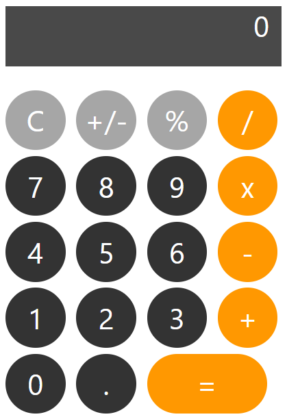

# ЛР 1. Calculator. HTML/CSS

**Цель** данной лабораторной работы - знакомство с инструментами построения пользовательских интерфейсов web-сайтов: HTML, CSS. В ходе выполнения работы, вам предстоит ознакомиться с кодом реализации простого калькулятора,  и затем выполнить задания по варианту.



## План

1. HTML- разметка
2. Базовая структура HTML-документа
3. Создание проекта
4. Верстка калькулятора
5. CSS
6. Применение CSS к HTML-документу
7. Стилизация верстки калькулятора с помощью CSS
8. Задание

## 1. HTML-разметка

HTML - это язык разметки, с помощью которого описывается содержимое веб-страницы: текстовые поля, таблицы, кнопки, заголовки, ссылки, в общем - все, что пользователь видит на странице. Для использования HTML-элементов на странице используются тэги. В основном на каждый элемент в документе приходится по два тэга: открывающий и закрывающий, но для обозначения некоторых элементов достаточно только открывающего. У тэгов могут быть атрибуты, с помощью которых задается дополнительная информация об html-элементе. Синтаксис объявления html-элемента выглядит примерно так:

```html
<тэг атрибут="значение_атрибута">Содержимое тэга</тэг>
```

Рассмотрим некоторые html-элементы и их тэги:

### Текст

1. В html присутствуют 6 тэгов для выделения **заголовков**:

    ```html
    <h1>Этот текст будет отображен браузером как заголовок первого уровня (крупнейший)</h1>
    <h2>А этот - как заголовок второго уровня (поменьше) </h2>
    ...
    <h6>Самый мелкий заголовок</h6>
    ```

2. текст можно форматировать:

    ```html
    <i> Этот текст будет отображен курсивом </i>
    <b> этот будет выделен жирным </b>
    <u> а этот будет подчеркнут </u>
    ```

3. текст можно группировать в параграф (абзац):

    ```html
    <p>Это параграф какого-то текста.</p>
    <p>Следующий параграф текста</p>
    ```

### Списки

1. ненумерованный список (unordered list UL)

    ```html
    <ul> <!-- начинаем ненумерованный список-->
      <li> первый элемент списка </li>
      <li> второй элемент списка </li>
      <li> третий элемент списка </li>
    </ui> <!-- список закончен -->
    ```

2. Нумерованный список (ordered list OL):

    ```html
    <ol>
      <li> первый элемент списка </li>
      <li> второй элемент списка </li>
    </ol>
    ```

### Гиперссылки

1. ссылка на ресурс

    Для создания ссылки используется парный тэг `<a>`. У него присутствует несколько атрибутов, позволяющих ссылку настроить:

    - `href`- адрес ресурса, на который ссылка ссылается, например <https://google.com>
    - `target` - в каком фрейме (окне) открывать документ, по умолчанию стоит в текущем.

        ```html
        <!-- переход по этой ссылке откроет google.com в текущем окне -->
        <a href="https://google.com"> Click me! </a>
        
        <!-- эта ссылка открое google.com в новом окне браузера -->
        <a href="https://google.com" target="_blank"> Click me! </a>
        ```

2. якорь

    Внутри HTML-страницы с помощью того-же тэга `<a>` можно расставить так называемые “якоря”. Грубо говоря, это - закладки на странице. Якоря затем можно использовать в гиперссылках для перемещения к определенному элементу страницы, где установлен якорь.

    ```html
    <p>
      <a name="some_paragraph"></a>   <!-- устанавливаем якорь -->
      Lorem Ipsum is simply dummy text of ...
    </p>
    
    <p>
    Следующий параграф текста, в котором мы установим ссылку на якорь.
    <a href="#some_paragraph">При нажатии на эту ссылку, пользователь будет перенаправлен к месту установки якоря.</a>
    </p>
    ```

## 2. Базовая структура HTML-документа

Простейший html-документ выглядит следующим образом:

```html
<!DOCTYPE html> <!--Указание браузеру, какой стандарт HTML использовать (сейчас HTML 5 по умолчанию)-->
<html lang="ru"> <!--Начало html-блока. Можно указать язык, чтобы избежать ошибок отображения текста-->

<!-- секция head, как правило, используется для описания служебной и мета информации,
    в ней также можно указывать ссылки на нужные странице ресурсы, например, шрифты, скрипты и т.д.-->
<head>
  <meta charset="UTF-8">             <!--указание кодировки символов-->
  <title>Моя первая страница</title> <!--Заголовок страницы, который будет отображен во вкладке браузера-->
</head>

<!--секция body - это тело документа. Здесь размещается вся информация, которая будет показана на странице-->
<body>
    <h2>Lorem Ipsum</h2>
</body>

</html> <!--конец html-документа -->
```

HTML-элементов существует большое количество, мы рассмотрели лишь небольшую часть. Почитать про другие HTML-тэги, чтобы научиться вставлять изображения, таблицы, поля ввода, формы и прочее можно [здесь](https://www.w3schools.com/html/default.asp).

## 3. Создание проекта

Для данной лабораторной работы будем использовать [VS Code](https://code.visualstudio.com).

- Заходим в меню создания проекта и выбираем: **Создать файл**
- Создайте HTML-файл: **calculator.html**

## 4. Верстка калькулятора

В HTML-файл поместите следующее содержимое. Здесь определёны все составляющие калькулятора (кнопки и поле вывода результата вычислений). Для каждого активного элемента определен атрибут `id` ( уникальный идентификатор), он потребуется в дальнейшем, чтобы обращаться к элементам из JavaScript.

```html
<!DOCTYPE html>
<html>

<head>
  <title>Калькулятор</title>
</head>

<body>
  <div> <!-- div - это базовый html-контейнер, который может содержать в себе другие html-элементы. -->
    
    <!-- блок с экраном калькулятора, где будет выводиться результат вычислений. -->
    <div id="result">
      0
    </div>

    <!-- блок с кнопками калькулятора. -->
    <div>
      <!--горизонтальный ряд из четырех кнопок-->
      <div>  
        <button id="btn_op_clear">C</button>    <!-- про тэг кнопки: https://www.w3schools.com/tags/tag_button.asp -->
        <button id="btn_op_sign">+/-</button>
        <button id="btn_op_percent">%</button>
        <button id="btn_op_div">/</button>
      </div>

      <div>
        <button id="btn_digit_7">7</button>
        <button id="btn_digit_8">8</button>
        <button id="btn_digit_9">9</button>
        <button id="btn_op_mult">x</button>
      </div>

      <div>
        <button id="btn_digit_4">4</button>
        <button id="btn_digit_5">5</button>
        <button id="btn_digit_6">6</button>
        <button id="btn_op_minus">-</button>
      </div>

      <div>
        <button id="btn_digit_1">1</button>
        <button id="btn_digit_2">2</button>
        <button id="btn_digit_3">3</button>
        <button id="btn_op_plus">+</button>
      </div>

      <div>
        <button id="btn_digit_0">0</button>
        <button id="btn_digit_dot">.</button>
        <button id="btn_op_equal">=</button>
      </div>
    </div>
  </div>
</body>
</html>
```

Если открыть этот HTML-документ в браузере, мы получим не самый изящный калькулятор. Чтобы задать параметры внешнего вида элементов, необходимо использовать CSS.


## 5. CSS

CSS (***Cascading Style Sheets***) - каскадные таблицы стилей. С помощью этого инструмента мы можем кастомизировать отображение различных HTML-элементов на странице, например сделать кнопки круглыми или задать им определенный цвет.

Рассмотрим синтаксис. CSS-правило (стиль) содержит селектор и блок объявлений. Селектор определяет к каким HTML-элементам нужно применить перечисленные в блоке объявлений свойства.

```css
имя_селектора {          
  свойство1: значение;
  свойство2: значение;          
  ...
}                       
```

1. **CSS element Selector**

    Существует несколько видов селекторов. Например, если мы хотим задать одинаковые правила для всех заголовков первого уровня, мы можем создать CSS-правило с именем селектора `h1`. Также можно поступить и с другими HTML-элементами.

    ```css
    /* css */
    h1 {               
      color: blue;    
      font-size: 12px;            
    } 
    ```

    ```html
    <!-- HTML -->
    <body>
      <h1>Заголовок</h1>
      <h1>Еще заголовок</h1>
    </body>
    ```

    Теперь, при использовании тэга `<h1>` в HTML документе, ко всем заголовкам первого уровня будут применены заданные правила: синий цвет и размер шрифта в 12px.

    

2. **CSS id Selector**

    Селектор по идентификатору позволяет задать правила для конкретного HTML-элемента с конкретным уникальным идентификатором. Имя такого селектора совпадает с идентификатором HTML-элемента, но начинается с решётки:

    ```html
    <!-- HTML -->
    
    <div id="my_custom_element">
      Lorem Ipsum is simply dummy text
    </div>
    ```

    ```css
    /*  css */
    #my_custom_element {
          text-align: center;
          color: red;
    }
    ```

3. **CSS class Selector**

    У HTML-элементов есть атрибут **class**. Классовый селектор применяет заданные CSS свойства к тем HTML-элементам, которые принадлежат конкретному классу. Причем один HTML-элемент может принадлежать сразу к нескольким классам. Имя такого селектора начинается с точки.

    ```css
    /* css */
    
    /* синий текст по центру */
    .my-centered-blue { 
      text-align: center;
      color: blue;         
    }
    
    /* огромный текст курсивом */
    .my-large-italic { 
      font-size: xxx-large;
      font-style: italic;
    }
    ```

    ```html
    <!-- HTML -->
    
    <p class="my-centered-blue my-large-italic">
      Этот параграф принадлежит к двум классам, поэтому комбинирует их свойства
    </p>
    <div class="my-large-italic">
      Этот блок принадлежит только к классу my-large-italic
    </div>
    ```

    

Также можно создать классовый селектор, дейсвующий только на конкретный тип HTML-элементов, например на параграфы:

```css
/* css */

p.my-large-italic { 
  font-size: xxx-large;
  font-style: italic;
}
```

## 6. Применение CSS к HTML-документу

Существует несколько вариантов встраивания CSS-правил в HTML-документ. CSS можно расположить в секции `<head>`, в рамках тэга `<style>`

```html
<!-- HTML -->
<head>
  <title>калькулятор</title>
  <style>
    .my-center-red { 
      color: red;
      text-align: center;
    }
  </style>
</head>

<body>
    <p class="my-center-red"> Hello! </p>
</body>
```

Второй, более предпочтительный, вариант - описание CSS стилей в отдельном файле, подключить который к HTML-документу можно сославшись на него в секции `head`:

```html
<head> 
  <title>калькулятор</title>
  <!-- указываем, что файл style.css содержит таблицу стилей (stylesheet) -->
  <link rel="stylesheet" href="style.css"> 
</head>
```

Браузер, читая html документ подгрузит стили из этого файла.

Также есть возможность задать стиль для элемента напрямую через атрибут style, но делать так не рекомендуется:

```html
<button style="margin-right: 5px; backgroud: red;">Красная кнопка</button>
```

## 7. Стилизация верстки калькулятора с помощью CSS

Приступим к стилизации созданной ранее верстки калькулятора. Создайте css-файл и пропишите в нем стили для элементов калькулятора: кнопок и окна вывода.

```css

/* опишем базовый стиль кнопки калькулятора */
.my-btn { 
  margin-right: 5px;           /* задаем отступ от кнопки справа */
  margin-top: 5px;             /* задаем отступ от кнопки сверху*/
  width: 50px;                 /* задаем ширину кнопки */
  height: 50px;                /* задаем высоту кнопки */
  border-radius: 50%;          /* округляем кнопку */
  border: none;                /* отключаем обводку */
  background: #515151;         /* задаем серый цвет кнопки */
  color: white;                /* задаем белый цвет текста внутри кнопки */
  font-size: 1.5rem;           /* увеличим размер шрифта */
  font-family: Arial, Helvetica, sans-serif; /* сменим шрифт */
  cursor: pointer;             /* при наведении на кнопку курсор будет изменен
                                  со стрелки на 'указательный палец' */
  user-select: none;           /* отключаем возможность выделить текст внутри кнопки */
} 

/* hover - это состояние элемента, когда на него наведен курсор */
.my-btn:hover {
  background: darkgray; /* при наведение курсора на кнопку, она будет окрашена в серый */
}

/* active - это состояние активации элемента. В случае кнопки - нажатие на нее */
.my-btn:active {
  filter: brightness(130%); /* увеличим интенсивность цвета для эффекта вспышки */
}

/* селектор для кнопок первостепенных операций */
.my-btn.primary { 
  background: #ff9801; /* цвет кнопки оранжевый */
}

/* селектор для кнопок второстепенных операций */
.my-btn.secondary { 
  background: #a6a6a6; /* цвет кнопки сервый */
}

/* селектор для кнопки расчета выражения (=) */
.my-btn.execute { 
  width: 100px;          /* сделаем кнопку шире других */
  border-radius: 34px;   /* подкорректируем округлость */
}

/* селектор для поля вывода результата */
.result { 
  width: 220px;
  height: 50px;
  margin-bottom: 15px;         /* отступ снизу */
  padding-right: 10px;         /* выступ справа */
  background: rgb(73, 73, 73); /* цвет можно задавать и таким образом */
  text-align: right;           /* примагнитим текст к правой стороне */
  color: #ffffff;              /* цвет текста белый */
  font-size: 1.5rem;
  font-family: Arial, Helvetica, sans-serif;
}
```

Теперь заполним атрибут `class` у HTML-элементов калькулятора, чтобы применить к ним созданные стили:

1. Кнопки циферблата: 0-9 и точка относятся к классу `my-btn`:

    ```html
    ...
    <button id="btn_digit_7" class="my-btn">7</button>
    <button id="btn_digit_8" class="my-btn">8</button>
    <button id="btn_digit_9" class="my-btn">9</button>
    ...
    ```

2. Кнопки второстепенных операций (C, +/-, %) принадлежат классам `my-btn` и `secondary`:

    ```html
    ...
    <button id="btn_op_clear" class="my-btn secondary">C</button>
    <button id="btn_op_sign" class="my-btn secondary">+/-</button>
    <button id="btn_op_percent" class="my-btn secondary">%</button>
    ...
    ```

3. Кнопки первостепенных операций принадлежат к классам `my-btn` и `primary`:

    ```html
    <button id="btn_op_mult" class="my-btn primary">x</button>
    ...
    <button id="btn_op_minus" class="my-btn primary">-</button>
    ...
    <button id="btn_op_plus" class="my-btn primary">+</button>
    ```

4. Кнопка “=” дополнительно относится еще и к классу `execute`:

    ```html
    <button id="btn_op_equal" class="my-btn primary execute">=</button>
    ```

5. Блок с экраном калькулятора относим к классу `result`:

    ```html
    <div id="result" class="result">
      0
    </div>
    ```

Если все выполнено верно, изображение страницы должно соответствовать требуемому.

## 8. Задание

1. Поменяйте цветовую палитру калькулятора с оранжево-серой на любую другую;
2. Сделайте фон калькулятора темным (наподобие ночной темы);
3. Сделайте кнопки квадратными вместо круглых.;
4. Измените цвет вывода результата на любой другой;
5. Сделайте окно вывода со скруглеными краями;
6. Поменяйте шрифт цифр;
7. Сделайте шрифт более толстым;
8. Измените цвет при наведении мышки на кнопку на другой;
9. Добавьте надпись внизу "ЛР выполнена ФИО";
10. Выровняйте калькулятор по центру;
11. Увеличьте размер окна вывода;
12. Добавьте кнопку для смены темы (смена цвета фона);
13. Сделайте шрифт тоньше;
14. Смените цвет шрифта;
15. Добавьте любое изображение на фон;
16. Добавьте кнопку со ссылкой на GitHub;
17. Сделайте поле с выпадающим списком;
18. Сделайте сворачивающиеся и разворачивающиеся подробности (Автор -> ФИО, Группа);
19. Добавьте поле с целью ЛР и подсветить слова: знакомство, HTML, CSS (с помощью тега).
