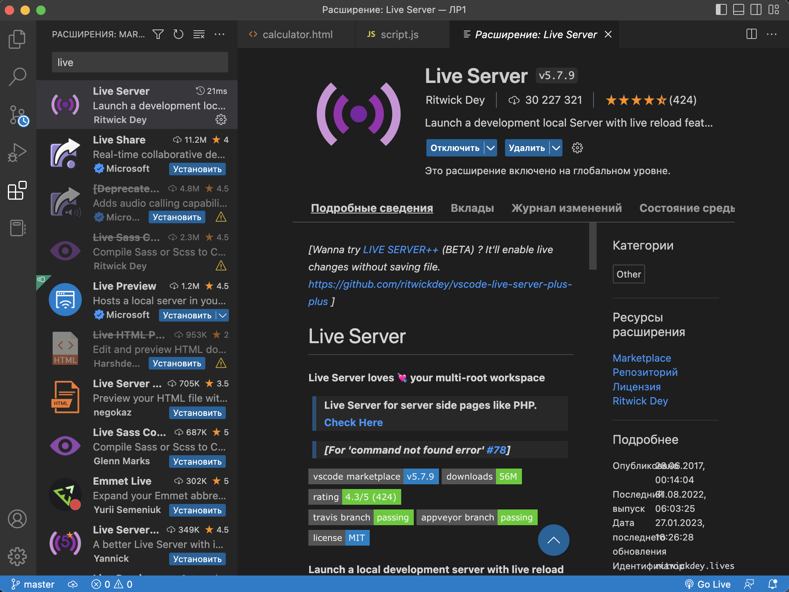

# ЛР 2. Calculator. JavaScript

**Цель** данной лабораторной работы - знакомство с инструментами построения пользовательских интерфейсов web-сайтов: HTML, CSS, JavaScript. В ходе выполнения работы, вам предстоит продолжить реализовывать простой калькулятор, и затем выполнить задания по варианту.

## План

1. Программирование логики с помощью JavaScript
2. Доступ к HTML-элементам из JavaScript
3. Программирование кнопок калькулятора
4. Запуск калькулятора с помощью LiveServer
5. Задание

## 1. Программирование логики с помощью JavaScript

Язык программирования JavaScript служит основным инструментом для описания логики и интерактивности веб-страниц. В данной работе с помощью JS мы будем программировать кнопки калькулятора, чтобы они работали.

### Как подключить JavaScript к HTML?

Есть два способа добавить JavaScript на веб-страницу:

1. **Встроенный скрипт** - когда код пишется прямо в HTML-файле внутри тега `<script>`:
```html
<script>
    // Здесь пишем JavaScript код
    console.log("Привет, мир!");
</script>
```

2. **Внешний файл** - когда код хранится в отдельном файле с расширением .js:
```html
<head> 
    <title>калькулятор</title>
    <link rel="stylesheet" href="style.css"> 
    <script type="text/javascript" src="script.js"></script> 
</head>
```

Для нашего калькулятора мы будем использовать второй способ, так как это более организованный подход.

## 2. Доступ к HTML-элементам из JavaScript

Чтобы управлять элементами на странице, нам нужно сначала получить к ним доступ. JavaScript предоставляет несколько способов это сделать:

### Основные методы получения элементов:

1. **По ID** (метод `getElementById`) - самый распространенный способ:
```html
<body>
    <p id="paragraph" className="textRed">Lorem Ipsum</p>

    <!--вложенный JS-скрипт-->
    <script>
    <!-- обращаемся к HTML-документу и ищем объект с id=paragraph -->
        element = document.getElementById("paragraph")

        <!-- через свойство innerHTML у полученного объекта можно изменить его содержимое-->
        element.innerHTML = "Измененный текст параграфа";
    </script>
</body>
```

2. **По тегу** - получаем все элементы определенного типа:
```js
// Получить все параграфы на странице
let paragraphs = document.getElementsByTagName("p")
```

3. **По классу** - получаем все элементы с определенным классом:
```js
// Получить все элементы с классом "button"
let buttons = document.getElementsByClassName("textRed")
```

про другие способы взаимодействия с HTML-элементами из JS можно почитать [здесь](https://www.w3schools.com/js/js_htmldom.asp).

## 3. Программирование кнопок калькулятора

Теперь давайте разберем код калькулятора по частям:

### Шаг 1: Инициализация переменных
```js
// Файл script.js
window.onload = function(){ 
    // Переменные для хранения чисел и операций
    let a = ''           // Первое число
    let b = ''           // Второе число
    let expressionResult = ''  // Результат вычисления
    let selectedOperation = null  // Выбранная операция
```

### Шаг 2: Получение доступа к элементам калькулятора
```js
    // Получаем доступ к экрану калькулятора в поле вывода
    outputElement = document.getElementById("result")

    // Получаем все кнопки с цифрами (их id начинаются с "btn_digit_")
    digitButtons = document.querySelectorAll('[id ^= "btn_digit_"]')
```

Разберем, что означает этот селектор `[id ^= "btn_digit_"]`:

1. `querySelectorAll()` - метод, который позволяет выбрать все элементы, соответствующие CSS-селектору
2. `[id ^= "btn_digit_"]` - это CSS-селектор атрибутов, где:
   - `id` - атрибут, по которому мы ищем
   - `^=` - оператор "начинается с" (starts with)
   - `"btn_digit_"` - текст, с которого должен начинаться id

Например, этот селектор найдет все элементы с такими id:
- `btn_digit_0`
- `btn_digit_1`
- `btn_digit_2`
- и так далее...

Это удобно, когда у нас есть группа похожих элементов (в нашем случае - кнопки с цифрами), и мы хотим получить их все сразу, не перечисляя каждый id отдельно.

### Шаг 3: Функция обработки нажатия на цифровые кнопки
```js
    function onDigitButtonClicked(digit) {
        // Если операция не выбрана, работаем с первым числом (a)
        if (!selectedOperation) {
            // Проверяем, не пытаемся ли мы добавить вторую точку
            if ((digit != '.') || (digit == '.' && !a.includes(digit))) { 
                a += digit
            }
            outputElement.innerHTML = a
        } 
        // Если операция выбрана, работаем со вторым числом (b)
        else {
            if ((digit != '.') || (digit == '.' && !b.includes(digit))) { 
                b += digit
                outputElement.innerHTML = b        
            }
        }
    }
```

### Шаг 4: Настройка обработчиков событий для кнопок

Обработчики событий - это функции, которые будут вызываться при совершении какого-либо события. Обработчики событий могут быть привязаны к конкретным элементам или ко всему документу.

#### События могут быть разными.
События мыши:
- click – происходит, когда кликнули на элемент левой кнопкой мыши (на устройствах с сенсорными экранами оно происходит при касании).
- contextmenu – происходит, когда кликнули на элемент правой кнопкой мыши.
- mouseover / mouseout – когда мышь наводится на / покидает элемент.
- mousedown / mouseup – когда нажали / отжали кнопку мыши на элементе.
- mousemove – при движении мыши.
События на элементах управления:
- submit – пользователь отправил форму <form>.
- focus – пользователь фокусируется на элементе, например нажимает на <input>.
Клавиатурные события:
- keydown и keyup – когда пользователь нажимает / отпускает клавишу.
События документа:
- DOMContentLoaded – когда HTML загружен и обработан, DOM документа полностью построен и доступен.
CSS events:
- transitionend – когда CSS-анимация завершена.

И многие другие. В нашем случае мы обрабатываем событие нажатия на кнопку - то есть click.

#### Способы задания обработчиков событий:

1. **Через атрибут HTML (inline-обработчик):**
```html
<button onclick="alert('Кнопка нажата!')">Нажми меня</button>
```

2. **Через свойство элемента (как в нашем калькуляторе):**
```js
element.onclick = function() {
    alert('Кнопка нажата!');
}
```

3. **Через метод addEventListener (современный способ):**
```js
element.addEventListener('click', function() {
    alert('Кнопка нажата!');
});
```
или стрелочная функция
```js
element.addEventListener('click', () => {
    alert('Кнопка нажата!');
});
```

4. **Через метод addEventListener с именованной функцией:**
```js
function handleClick() {
    alert('Кнопка нажата!');
}
element.addEventListener('click', handleClick);
```

Не рекомендуется использовать Inline-обработчики (через HTML), особенно объемных функций, потому что происходит смешивание HTML и JavaScript, что не является хорошей практикой. В первом и втором способе нельзя задать несколько обработчиков события, что позволяет сделать третий способ. Inlinre-обработчик невозможно удалить во время исполнения программы. AddEventListener имеет более гибкую настройку (например, фаза события и другие опции) и считается современным стандартом.
В нашем калькуляторе мы используем второй способ (через свойство onclick), так как для каждой кнопки нам нужен только один обработчик, и это делает код более простым и понятным.

Функция onсlick имеет объект события, доступ к которому можно получить внутри функции. В примере перечислены некоторые свойства объекта.
```js
element.addEventListener('click', function(event) {
    // вывести тип события, элемент и координаты клика
    alert(event.type + " на " + event.currentTarget);
    alert("Координаты: " + event.clientX + ":" + event.clientY);
});
```

Вернемся к созданию обработчиков в нашем калькуляторе. 
```js
    // Настраиваем обработчики для цифровых кнопок
    digitButtons.forEach(button => {
        button.onclick = function() {
            const digitValue = button.innerHTML
            onDigitButtonClicked(digitValue)
        }
    });

    // Настраиваем обработчики для кнопок операций
    document.getElementById("btn_op_mult").onclick = function() { 
        if (a === '') return
        selectedOperation = 'x'
    }
    document.getElementById("btn_op_plus").onclick = function() { 
        if (a === '') return
        selectedOperation = '+'
    }
    document.getElementById("btn_op_minus").onclick = function() { 
        if (a === '') return
        selectedOperation = '-'
    }
    document.getElementById("btn_op_div").onclick = function() { 
        if (a === '') return
        selectedOperation = '/'
    }
```

### Шаг 5: Кнопка очистки
```js
    // Очищаем все значения при нажатии на кнопку C (вешаем обработчик события click на кнопку С)
    document.getElementById("btn_op_clear").onclick = function() { 
        a = ''
        b = ''
        selectedOperation = ''
        expressionResult = ''
        outputElement.innerHTML = 0
    }
```

### Шаг 6: Кнопка равно
```js
    // Вычисляем результат при нажатии на = (вешаем обработчик события click на кнопку =)
    document.getElementById("btn_op_equal").onclick = function() { 
        // Проверяем, что у нас есть оба числа и операция
        if (a === '' || b === '' || !selectedOperation)
            return
            
        // Выполняем выбранную операцию - чтобы не плодить if, воспользуемся удобной и более наглядной функцией сравнения switch, которая на основе значения переданной переменной выполняет нужный кейс. В case указывается ожидаемое точное значение переменной (это может быть любое значение), а затем после : пишется код, который нужно выполнить в данном случае. Case проверяются последовательно, выход из switch происходит при попадании на break или если значение не совпало ни с чем.
        switch(selectedOperation) { 
            case 'x':
                expressionResult = (+a) * (+b)
                // обязательно пишется в конце действий case, чтобы выйти из switch, иначе продолжится сравнение case дальше
                break;
            case '+':
                expressionResult = (+a) + (+b)
                break;
            case '-':
                expressionResult = (+a) - (+b)
                break;
            case '/':
                expressionResult = (+a) / (+b)
                break;
            // желательно (но не обязательно) всегда прописывать дефолтное поведение, в случае если в переменной окажется не перечисленное выше значение. в нашем случае это не нужно.
            default:
                break;
        }
        
        // Сохраняем результат и очищаем второе число
        a = expressionResult.toString()
        b = ''
        selectedOperation = null

        // Показываем результат на экране
        outputElement.innerHTML = a
    }
};
```

## 4. Запуск калькулятора с помощью LiveServer

Чтобы увидеть наш калькулятор в действии, нам нужно запустить его на веб-сервере. Для этого мы будем использовать расширение Live Server в VS Code:

1. Откройте VS Code
2. Перейдите в раздел расширений (Extensions)
3. Найдите и установите "Live Server"
4. После установки нажмите кнопку "Go Live" в нижней панели VS Code



Теперь ваш калькулятор будет работать в браузере, и вы сможете видеть все изменения в реальном времени!

## 5. Задания для самостоятельной проработки

Попробуйте самостоятельно добавить следующие функции в калькулятор:

1. Запрограммируйте операцию смены знака +/-;
2. Запрограммируйте операцию вычисления процента %;
3. Добавьте кнопку стирания введенной цифры назад (backspace). Расположить кнопку можно, например, на месте нерабочих +/- и % кнопок;
4. Сделайте смену цвета фона по кнопке;
5. Запрограммируйте операцию вычисления квадратного корня √;
6. Запрограммируйте операцию возведения в квадрат x²;
7. Запрограммируйте операцию вычисления факториала x!;
8. Добавьте кнопку, которая за раз добавляет сразу три нуля (000);
9. Запрограммируйте накапливаемое сложние;
10. Запрограммируйте накапливаемое вычитание;
11. Сделайте смену цвета окна вывода результата по кнопке;
12. Добавьте в калькулятор вашу индивидуальную операцию.

### Подсказки для выполнения заданий:

1. Для смены знака используйте умножение на -1
2. Для процента делите число на 100
3. Для backspace используйте метод slice() для строк
4. Для смены цвета используйте style.backgroundColor
5. Для корня используйте Math.sqrt()
6. Для квадрата умножьте число на само себя
7. Для факториала используйте цикл или рекурсию
8. Для тройного нуля просто добавьте "000" к строке
9. Для накапливаемых операций сохраняйте предыдущий результат
10. Для индивидуальной операции проявите фантазию!
