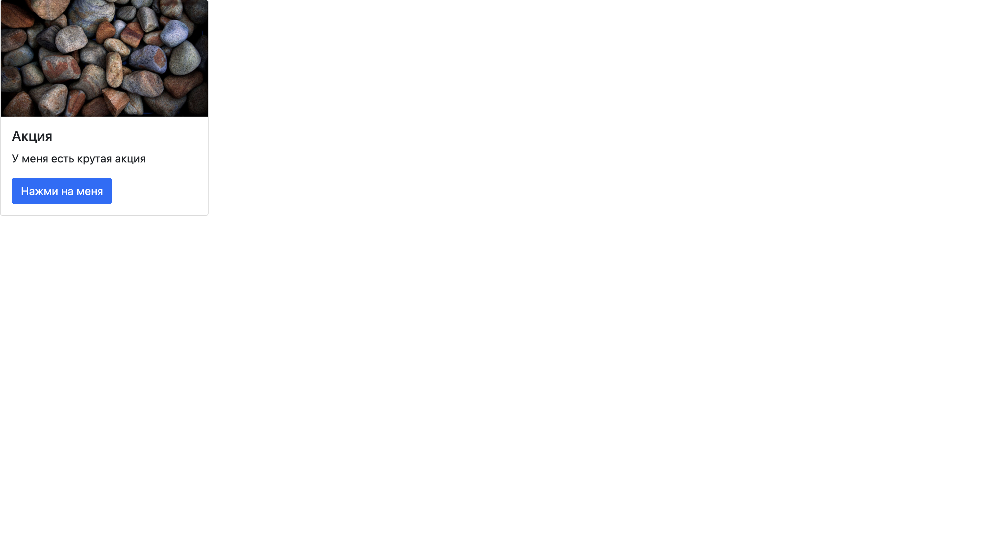
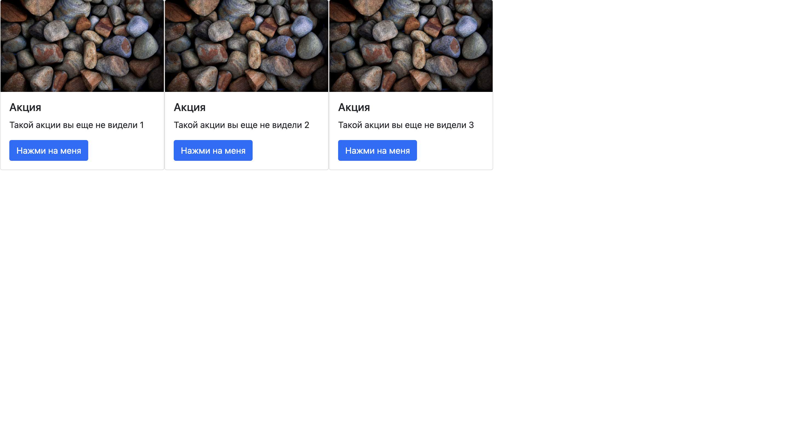

# ЛР 3. Простое веб-приложение. Верстка

**Цель** данной лабораторной работы - знакомство с node, npm, написание простого приложения на JavaScript. В ходе выполнения работы, вам предстоит ознакомиться с кодом реализации простого интерфейса и вывода данных, и затем выполнить задания по варианту.

## План

1. Инструменты для работы
2. Что такое node, npm и package.json
3. Как работать с html в JS
4. Инициализация проекта
5. Создание главной страницы, подключение bootstrap
6. Простая кнопка на JavaScript
7. Структурирование проекта
8. Верстка главной страницы
9. Верстка страницы продукта

## 1. Инструменты для работы

Для работы будем использовать инструменты из предыдущих лабораторной работы: [VS Code][vs-code] + [Live Server][vs-code-live-server].

**Перед началом работы необходимо установить на свой компьютер [Node.js][node-install].**

## 2. Что такое node, npm и package.json

### Node.js

Наш JavaScript код, который мы писали в предыдущих лабораторных, исполняется в браузере. В браузере у нас есть компилятор JavaScript кода в машинных код, в Google Chrome это движок [V8][v8]. Если мы хотим запускать код на нашем компьютере, а не в браузере, то нам нужно использовать [Node.js][node]. Node - это программная платформа, которая позволяет компилировать JavaScript код в машинный на нашем компьютере. Node.js добавляет возможность нам взаимодействовать с утройствами ввода-вывода, подключать внешние библиотеки. На нем в основном пишут веб-сервера, но есть возможность разрабатывать и десктопные оконные приложения и даже программировать микроконтроллеры.

### Установка Node.js 
- для установки node.js на macOS используйте [Homebrew](https://brew.sh)
- для установки node.js на Windows используйте [nvm](https://learn.microsoft.com/ru-ru/windows/dev-environment/javascript/nodejs-on-windows)

### Npm

В любом языке программирования нам нужно уметь работать с внешними библиотеками. На фронтенде для этого используется пакетный менеджер [Npm][npm]. С помощью npm мы можем скачивать нужные нам пакеты, которые потом будем использовать в нашем приложении. Все наши библиотеки скачиваются в специальную папку `node_modules`, вы увидите ее у себя в проекте, когда скачаете первую библиотеку.

### Package.json и package-lock.json

[Package.json][package.json] - это основной файл в нашем приложении, который хранит всю информацию о проекте. В этом файле хранится название проекта, описания, версия, скрипты и многое другое. Именно в этом файле храниться информация о всех пакетах, которые мы поставили через npm, и версия этих зависимостей.

[Package-lock.json][package-lock.json] - это файл, который хранит дерево зависимостей. Библиотеки, которые мы устанавливаем, могут иметь вложенные зависимости и этот файл хранит полное дерево.

## 3. Как работать с html в JS

В прошлых лабораторных работах мы уже работали с HTML версткой из нашего JavaScript кода, для этого у нас есть общирное API по работе с [DOM деревом][dom-api]. Сегодня мы будем использовать **getElementById** и **insertAdjacentHTML**, но функций намного больше.

## 4. Инициализация проекта

* Создаем пустую папку и открываем ее в VS Code.
* Инициализируем проект в npm с помощью команды `npm init`.

При инициализации проекта у нас будут спрашивать много вопросов, но их все можно пропустить нажав `Enter`. В конце у нас появится настроенный файл `package.json`.

Во все проекты принято добавлять `.gitignore` файл, который не будет добавлять лишнее в наш git репозиторий. Подробнее о `.gitignore` можно почитать [тут][about-gitignore].

* Создаем файл `.gitignore` и копируем туда содержимое [файла](./assets/.gitignore).

Мы создали проект, который состоит из файлов `package.json` и `.gitignore`. Можно приступать к написанию основного кода.

***По итогу мы имеем следующую структуру проекта.***

```bash
├── .gitignore
├── package.json
```

## 5. Создание главной страницы, подключение bootstrap

### Создание index.html

Мы создали проект, теперь давайте начнем писать код. Когда пользователь заходит на сайт, то ему сначала подгружается файл `index.html` с базовой версткой, а потом уже подгружаются стили и скрипты. Если в вашем приложении не будет `index.html` файла, то браузер не сможет загрузить его.

* Создаем файл `index.html`

```html
<!DOCTYPE html>
<html lang="en">
<head>
    <meta charset="UTF-8">
    <title>Simple App</title>
</head>
<body>
<div>Hello world!</div>
</body>
</html>
```

Если мы откроем html файл, то увидим страницу с надписью **Hello world!**.


Для того, чтобы было удобнее работать мы можем воспользоваться расширением Live Server, для этого открываем файл `index.html` и нажимаем `Go Live` в правом нижнем углу.

### Подключение bootstrap

Для того, чтобы было проще верстать используем библиотеку css стилей [bootstrap]. Это библиотека стилей, в которой можно брать верстку и применять у себя на сайте. Для подключения установим библиотеку через [npm][bootstrap-npm].

* Устанавливаем библиотеку с помощью команды `npm i bootstrap`

После установки библиотеки можно увидеть, что у нас появилась папка `node_modules` и файл `package-lock.json`. О них мы говорили выше. Так же изменился файл `package.json`, в нем появилась наша библиотека с зафиксированной версией.

* Проверим, что мы успешно скачали bootstrap, для этого добавим кнопку из библиотеки компонентов в `index.html`

```html
<!DOCTYPE html>
<html lang="en">
<head>
    <meta charset="UTF-8">
    <title>Simple App</title>
    <link rel="stylesheet" href="node_modules/bootstrap/dist/css/bootstrap.min.css">
</head>
<body>
<button type="button" class="btn btn-primary">Hello world!</button>

<script src="node_modules/bootstrap/dist/js/bootstrap.bundle.min.js"></script>
</body>
</html>
```


Как мы видим наша кнопка видна, значит мы все подключили успешно и можно переходить к написанию JavaScript кода.

***По итогу мы имеем следующую структуру проекта.***

```bash
├── node_modules/
├── .gitignore
├── package-lock.json
├── package.json
├── index.html
```

### 6. Простая кнопка на JavaScript

У нас есть приложение, которое имеет главную страницу. Сейчас у нас кнопка находится в файле `index.html`, попробуем ее из HTML файла и нарисовать с помощью JS. Для того, чтобы в JS получить доступ к нашему HTML дереву у нас должен быть корневой элемент. Он будет родителем и к нему мы будем добавлять остальные компоненты.

* Добавляем корневой элемент в `index.html`

```html
<!DOCTYPE html>
<html lang="en">
<head>
    <meta charset="UTF-8">
    <title>Simple App</title>
    <link rel="stylesheet" href="node_modules/bootstrap/dist/css/bootstrap.min.css">
</head>
<body>
<div id="root"></div>

<script src="node_modules/bootstrap/dist/js/bootstrap.bundle.min.js"></script>
</body>
</html>
```

Теперь у нас есть корневой элемент, к котором мы можем обратиться из нашего JavaSctip. Создадим js файл, подключим его и попробуем обратиться к HTML дереву.

* Создаем файл `main.js`, для доступа к HTML будем использовать **getElementById**

```js
const root = document.getElementById('root');
```

У нас есть простой JS файл, который получает корневой элемент. Для того, чтобы этот файл загрузился в браузер необходимо добавить его в наш `index.html`

* Подключаем этот файл в `index.html`

```html
<!DOCTYPE html>
<html lang="en">
<head>
    <meta charset="UTF-8">
    <title>Simple App</title>
    <link rel="stylesheet" href="node_modules/bootstrap/dist/css/bootstrap.min.css">
</head>
<body>
<div id="root"></div>
<script src="main.js" type="module"></script>

<script src="node_modules/bootstrap/dist/js/bootstrap.bundle.min.js"></script>
</body>
</html>
```

У нас в `main.js` файле есть корневой элемент. Попробуем в него добавить нашу кнопку, которую раньше мы создавали в HTML.

* Добавляем кнопку в `main.js`

```js
const root = document.getElementById('root');

root.insertAdjacentHTML('beforeend', '<button type="button" class="btn btn-primary">Hello world 2!</button>')
```


Как мы видим наша кнопка появилась на экране, значит мы правильно написали на JavaScript файл. Теперь попробуем написать что-то посложнее.

***По итогу мы имеем следующую структуру проекта.***

```bash
├── node_modules/
├── .gitignore
├── package-lock.json
├── package.json
├── index.html
├── main.js
```

### 7. Структурирование проекта

#### Структура проекта

Мы написали простую страничку на JS, но мы же не сможем вечно все писать в одном файле. Нам необходимо как-то разбивать наш проект по мелким файлам.

Сейчас мы имеем следующее разбиение по файлам:

```bash
├── node_modules/
├── .gitignore
├── package-lock.json
├── package.json
├── index.html
├── main.js
```

В фронтенде верстку разделяют на страницы (Pages) и компоненты (Components). Страница - это отдельная страница как наша главная. Компонент - маленькие блоки из которых состоит страница.

Добавим дополнительные папки в нашу структуру:

* `pages` - тут будут лежать наши страницы
* `components` - тут будут лежать наши компоненты

Теперь наша структура выглядит следующим образом:

```bash
├── node_modules/
├── .gitignore
├── package-lock.json
├── package.json
├── pages/
├── components/
├── index.html
├── main.js
```

#### Страница на новой архитектуре

Теперь попробуем переписать нашу страницу под новую архитектуру.

* Создаем нашу страницу `pages/main/index.js`

```js
export class MainPage {
    
}
```

Наша страница должна рендериться в root элемент. Добавим конструктор, где будем получать родительский элемент и сохранять его.

* Добавляем конструктор

```js
export class MainPage {
    constructor(parent) {
        this.parent = parent;
    }
}
```

У нас есть родительский элемент, но наш нужна функция при вызове которой мы будем рендерить эту страницу.

* Добавляем функцию рендера

```js
export class MainPage {
    constructor(parent) {
        this.parent = parent;
    }
    
    render() {
        
    }
}
```

* Добавляем логику рендера кнопки на странице

```js
render() {
    this.parent.insertAdjacentHTML('beforeend', '<button type="button" class="btn btn-primary">Hello world 3!</button>');
}
```

У нас есть класс страницы, теперь необходимо добавить вызов этого класса в нашем основном файле `main.js`

* Добавляем вызов файла в `main.js`

```js
import {MainPage} from "./pages/main/index.js";

const root = document.getElementById('root');

const mainPage = new MainPage(root);
mainPage.render();
```


Все работает, кнопка видна на странице. Мы сказали, что у нас страница должна состоять из мелки компонентов, а сейчас верстка кнопки происходит на странице. Вынесем в компонент и добавим ее на странице.

* Создаем наш компонент `components/button/index.js`

```js
export class ButtonComponent {
    constructor(parent) {
        this.parent = parent;
    }

    render() {
        this.parent.insertAdjacentHTML('beforeend', '<button type="button" class="btn btn-primary">Hello world 4!</button>');
    }
}
```

* Подключаем наш компонент на странице

```js
import {ButtonComponent} from "../../components/button/index.js";

// ...

render() {
    const button = new ButtonComponent(this.parent)
    button.render()
}
```


Все работает, кнопка видна на странице. Теперь сделаем нашу страницу такой, чтобы она была готова к нашим данным.

***По итогу мы имеем следующую структуру проекта.***

```bash
├── node_modules/
├── .gitignore
├── package-lock.json
├── package.json
└── pages
    └── main
        └── index.js
└── components
    └── button
        └── index.js
├── index.html
├── main.js
```

## 8. Верстка главной страницы

Теперь добавим на главную страницу список карточек. Для отображения будем использовать [карточки из bootstrap][bootstrap-card].

* Создаем компонент карточки `components/product-card/index.js`

```js
export class ProductCardComponent {
    constructor(parent) {
        this.parent = parent;
    }

    render() {
        
    }
}
```

* Добавляем верстку карточки. Для удобства вынесем верстку в отдельную функцию

```js
getHTML() {
    return (
        `
            <div class="card" style="width: 300px;">
                
                <div class="card-body">
                    <h5 class="card-title">Акция</h5>
                    <p class="card-text">Вот тут информация об акции</p>
                    <button class="btn btn-primary"">Нажми на меня</button>
                </div>
            </div>
        `
    )
}

render() {
    const html = this.getHTML()
    this.parent.insertAdjacentHTML('beforeend', html)
}
```

* Теперь добавим наш компонент на страницу

```js
import {ProductCardComponent} from "../../components/product-card/index.js";

// ...

render() {
    const productCard = new ProductCardComponent(this.parent)
    productCard.render()
}
```


Отлично, у нас отображается карточка. Сейчас у нас данные захардкожены в компонент, а нам бы хотелось прокидывать данные в компонент.

* Добавим отрисовку компонента из данных

```js
getHTML(data) {
    return (
        `
            <div class="card" style="width: 300px;">
                
                <div class="card-body">
                    <h5 class="card-title">${data.title}</h5>
                    <p class="card-text">${data.text}</p>
                    <button class="btn btn-primary">Нажми на меня</button>
                </div>
            </div>
        `
    )
}

render(data) {
    const html = this.getHTML(data)
    this.parent.insertAdjacentHTML('beforeend', html)
}
```

Теперь у нас функция `render` принимает данные, которые будет отрисовывать. При вызове компонента нам необходимо прокидывать тестывое данные со страницы, потом это мы заменим на получение данных с бекенда.

* Прокидываем тестовые данные в компонент со страницы

```js
getData() {
    return {
        id: 1,
        src: "https://i.pinimg.com/originals/c9/ea/65/c9ea654eb3a7398b1f702c758c1c4206.jpg",
        title: "Акция",
        text: "У меня есть крутая акция"
    }
}

render() {
    const data = this.getData()
    const productCard = new ProductCardComponent(this.parent)
    productCard.render(data)
}
```



Отлично, данные отображаются. Теперт нам хотелось бы отрисовать больше чем один компонент. У нас может приходить список данных, для отрисовки в карточках, а сейчам мы умеем рисовать только одну карточку. Для этого нам нужно добавить родительски элемент на главной странице. В этот элемент мы будем добавлять все наши компоненты.

* Добавляем родительский элемент

```js
get pageRoot() {
    return document.getElementById('main-page')
}
    
getHTML() {
    return (
        `
            <div id="main-page" class="d-flex flex-wrap"><div/>
        `
    )
}
    
render() {
    this.parent.innerHTML = ''
    const html = this.getHTML()
    this.parent.insertAdjacentHTML('beforeend', html)

    const data = this.getData()
    const productCard = new ProductCardComponent(this.pageRoot)
    productCard.render(data)
}
```

У нас есть элемент, в который мы будем добавлять наши дочерние компоненты. Теперь надо изменить логику так, чтобы мы умели работать с массивом данных, а не с одним элементом.

* Перерабатываем логику для работы с массивом данных

```js
getData() {
    return [
        {
            id: 1,
            src: "https://i.pinimg.com/originals/c9/ea/65/c9ea654eb3a7398b1f702c758c1c4206.jpg",
            title: "Акция",
            text: "Такой акции вы еще не видели 1"
        },
        {
            id: 2,
            src: "https://i.pinimg.com/originals/c9/ea/65/c9ea654eb3a7398b1f702c758c1c4206.jpg",
            title: "Акция",
            text: "Такой акции вы еще не видели 2"
        },
        {
            id: 3,
            src: "https://i.pinimg.com/originals/c9/ea/65/c9ea654eb3a7398b1f702c758c1c4206.jpg",
            title: "Акция",
            text: "Такой акции вы еще не видели 3"
        },
    ]
}
    
render() {
    this.parent.innerHTML = ''
    const html = this.getHTML()
    this.parent.insertAdjacentHTML('beforeend', html)
    
    const data = this.getData()
    data.forEach((item) => {
        const productCard = new ProductCardComponent(this.pageRoot)
        productCard.render(item)
    })
}
```



Мы смогли отрисовать сразу несколько компонентов, но если мы попробуем нажать на кнопку, то ничего не произойдет. Добавим обработчики нажатия на кнопку. Для того, чтобы нам это сделать нужно внутри компонента подписаться на собитие клик по кнопке и обработать вызов этой функции. Функция, которая будет срабатывать по клику будем прокидывать в компонент из страницы.

* Добавим нашей кнопку уникальный id, чтобы по нему мы могли найти кнопку и подписаться на событие клика

```js
<button class="btn btn-primary" id="click-card-${data.id}" data-id="${data.id}">Нажми на меня</button>
```

У кнопки появился уникальный id и мы можем подписаться на клик по этой кнопки. Для подписки на событие используем функцию **addEventListener**

* Добавляем подписку на нажатие кнопки

```js
addListeners(data, listener) {
    document
        .getElementById(`click-card-${data.id}`)
        .addEventListener("click", listener)
}

render(data, listener) {
    const html = this.getHTML(data)
    this.parent.insertAdjacentHTML('beforeend', html)
    this.addListeners(data, listener)
}
```

У кнопки в нашей появился обработчик, который будет срабатывать при нажатии на нее. Добавим на главной странице функцию, которая будет срабатывать по нажатию и прокинем ее в компонент. При создании кнопки мы добавли ей data атрибут, чтобы при обработке мы могли его достать и узнать по какому элементу мы нажали.

* Добавляем обработчик на главной странице

```js
clickCard(e) {
    const cardId = e.target.dataset.id
}

const productCard = new ProductCardComponent(this.pageRoot)
productCard.render(item, this.clickCard.bind(this))
```

Теперь у нас есть все что нам нужно, осталось создать вторую страницу и нарисовать ее.

***По итогу мы имеем следующую структуру проекта.***

```bash
├── node_modules/
├── .gitignore
├── package-lock.json
├── package.json
└── pages
    └── main
        └── index.js
└── components
    └── product-card
        └── index.js
├── index.html
├── main.js
```

## 9. Верстка страницы продукта

У нас есть главная страница, добавим страницу продукта.

* Создаем страницу продукта `pages/product/index.js`. Наша страница будет принимать дополнительный аргумент id, номер выбранной страницы

```js
export class ProductPage {
    constructor(parent, id) {
        this.parent = parent
        this.id = id
    }

    getData() {
        return {
            id: 1,
            src: "https://i.pinimg.com/originals/c9/ea/65/c9ea654eb3a7398b1f702c758c1c4206.jpg",
            title: `Акция ${this.id}`,
            text: "Такой акции вы еще не видели"
        }
    }

    get pageRoot() {
        return document.getElementById('product-page')
    }

    getHTML() {
        return (
            `
                <div id="product-page"></div>
            `
        )
    }

    render() {
        this.parent.innerHTML = ''
        const html = this.getHTML()
        this.parent.insertAdjacentHTML('beforeend', html)
    }
}
```

У нас есть страница продукта, нужна создать компонент, который мы будем отрисовывать на этой странице.

* Создаем компонент продукта `components/product/index.js`

```js
export class ProductComponent {
    constructor(parent) {
        this.parent = parent
    }

    getHTML(data) {
        return (
            `
                <div class="card mb-3" style="width: 540px;">
                    <div class="row g-0">
                        <div class="col-md-4">
                            
                        </div>
                        <div class="col-md-8">
                            <div class="card-body">
                                <h5 class="card-title">${data.title}</h5>
                                <p class="card-text">${data.text}</p>
                            </div>
                        </div>
                    </div>
                </div>
            `
        )
    }

    render(data) {
        const html = this.getHTML(data)
        this.parent.insertAdjacentHTML('beforeend', html)
    }
}
```

* Добавим отрисовку компонента на странице продукта

```js
import {ProductComponent} from "../../components/product/index.js";

// ...

render() {
    this.parent.innerHTML = ''
    const html = this.getHTML()
    this.parent.insertAdjacentHTML('beforeend', html)

    const data = this.getData()
    const product = new ProductComponent(this.pageRoot)
    product.render(data)
}
```

У нас есть страница продукта, сделаем так, чтобы при нажатии на карточку на главной странице у нас открывалась страница продукта.

* Добавляем открытие страницы продукта при нажатии на карточку

```js
import {ProductPage} from "../product/index.js";

// ...

clickCard(e) {
    const cardId = e.target.dataset.id

    const productPage = new ProductPage(this.parent, cardId)
    productPage.render()
}
```


Все работает. При нажатии на кнопку в карточке на главной странице у нас открывается страница продукта. Для удобства добавим кнопку, которая будет возвращать на главную страницу.

* Создаем компонент `components/back-button/index.js`

```js
export class BackButtonComponent {
    constructor(parent) {
        this.parent = parent;
    }

    addListeners(listener) {
        document
            .getElementById("back-button")
            .addEventListener("click", listener)
    }

    getHTML() {
        return (
            `
                <button id="back-button" class="btn btn-primary" type="button">Назад</button>
            `
        )
    }

    render(listener) {
        const html = this.getHTML()
        this.parent.insertAdjacentHTML('beforeend', html)
        this.addListeners(listener)
    }
}
```

* Добавляем кнопку на страницу продукта и ее обработчик

```js
import {BackButtonComponent} from "../../components/back-button/index.js";
import {MainPage} from "../main/index.js";

// ...

clickBack() {
    const mainPage = new MainPage(this.parent)
    mainPage.render()
}

render() {
    this.parent.innerHTML = ''
    const html = this.getHTML()
    this.parent.insertAdjacentHTML('beforeend', html)

    const backButton = new BackButtonComponent(this.pageRoot)
    backButton.render(this.clickBack.bind(this))

    const data = this.getData()
    const stock = new ProductComponent(this.pageRoot)
    stock.render(data)
}
```


Все работает, если нажать на кнопку, то мы вернемся обратно на главную страницу. На этом лабораторная работа закончилась.

***По итогу мы имеем следующую структуру проекта.***

```bash
├── node_modules/
├── .gitignore
├── package-lock.json
├── package.json
└── pages
    └── main
        └── index.js
    └── product
        └── index.js
└── components
    └── product-card
        └── index.js
    └── product
        └── index.js
    └── back-button
        └── index.js
├── index.html
├── main.js
```

## Дополнительные материалы

Создать двухстраничное приложение из примера по вариантам.
Вариант состоит из темы и компонента, который необходимо использовать.
Все данные должны соответствовать вашей теме.
Компонент можно применить по своему усмотрению.

Варианты:

1. Тема - собаки, Компонент - [аккордеон](https://bootstrap-4.ru/docs/5.2/components/accordion/).
2. Тема - кошки, Компонент - [уведомления](https://bootstrap-4.ru/docs/5.2/components/alerts/).
3. Тема - продукты, Компонент - [значки](https://bootstrap-4.ru/docs/5.2/components/badge/).
4. Тема - учебные предметы, Компонент - [карусель](https://bootstrap-4.ru/docs/5.2/components/carousel/).
5. Тема - дизайн, Компонент - [информер](https://bootstrap-4.ru/docs/5.2/components/popovers/).
6. Тема - финансы, Компонент - [всплывающие сообщения](https://bootstrap-4.ru/docs/5.2/components/toasts/).
7. Тема - фотографии, Компонент - [группа кнопок](https://bootstrap-4.ru/docs/5.2/components/button-group/).

## Полезные ссылки

1. Почитать про **document** [тут][document]
2. Почитать про **getElementById** [тут][getElementById]
3. Почитать про **insertAdjacentHTML** [тут][insertAdjacentHTML]
4. Почитать про **event** [тут][event]
5. Почитать про **addEventListener** [тут][addEventListener]

[vs-code]: https://code.visualstudio.com
[vs-code-live-server]: https://marketplace.visualstudio.com/items?itemName=ritwickdey.LiveServer
[v8]: https://v8.dev
[node]: https://nodejs.org
[node-install]: https://nodejs.org/en/download
[npm]: https://www.npmjs.com
[package.json]: https://docs.npmjs.com/cli/v9/configuring-npmpackage-json
[package-lock.json]: https://docs.npmjs.com/cli/v9/configuring-npm/package-lock-json
[dom-api]: https://learn.javascript.ru/dom-nodes
[about-gitignore]: https://tyapk.ru/blog/post/gitignore
[bootstrap]: https://bootstrap-4.ru
[bootstrap-npm]: https://www.npmjs.com/package/bootstrap
[bootstrap-card]: https://bootstrap-4.ru/docs/5.2/components/card
[document]: https://developer.mozilla.org/ru/docs/Web/API/Document
[getElementById]: https://developer.mozilla.org/ru/docs/Web/API/Document/getElementById
[insertAdjacentHTML]: https://developer.mozilla.org/ru/docs/Web/API/Element/insertAdjacentHTML
[event]: https://developer.mozilla.org/ru/docs/Web/API/Event
[addEventListener]: https://developer.mozilla.org/ru/docs/Web/API/EventTarget/addEventListener
