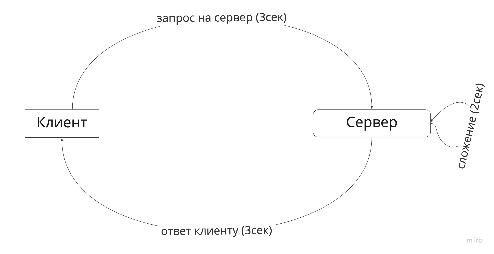

# ЛР 5. Простое веб-приложение. Работа с Api (Продолжение)

## Цель
Целью данной лабораторной работы также является взаимодействие с внешним Api. Но если в прошлой лабораторной работе мы
это делали с помощью XMLHttpRequest, то в этот раз мы будем пользоваться более современным "инструментом" - `fetch`.

В ходе выполнения работы, вам предстоит ознакомиться с небольшим, но надеюсь полезным теоретическим материалом,
с кодом реализации простого взаимодействия с внешним Api,
с получением данных и выводом их в интерфейс пользователя,
а также вам предстоит выполнить задания по варианту.

## План
1. Введение в `Promise`
2. Использование `Promise`
3. Что такое `async await` в JS
4. Пояснение про `fetch`
5. Пример использования `fetch`

## Введение в `Promise`
Казалось бы, при чем здесь `promises` (промисы), если мы хотели делать запросы на сервера и изучать `fetch`?
Дело в том, что fetch работает с использованием промисов, это функция, которая возвращает `promise`.

Поэтому прежде чем говорить о том, что такое fetch и зачем он нужен, обратимся к промисам.

*Promise* - это специальный объект, который используется в языке для отложенных и асинхронных вычислений.
Прочитал(а) и ничего не понятно? Это нормально, мне тоже было в начале не ясно, попробуем вместе разобраться:

Асинхронная операция или вычисление - операция, которая выполнится в будущем, не прямо сейчас. Например - нам очень хочется посчитать сумму двух чисел,
но мы сами этого не умеем (так получилось) и для этого,
делаем запрос на сервер, чтобы он посчитал это за нас и выдал нам какой-то результат.
Запрос на сервер - это асинхронная операция, она требует какого-то времени на свое выполнение, поэтому она выполнится в будущем. На что уйдет это время?

Запрос должен дойти до сервера на этой уйдет 3 сек времени, на сервере
должна выполнится какая-то простая бизнес-логика, а именно сложение двух чисел, которое займет 2 сек и отправка результата к нам обратно, на нее мы потратим еще 3 секунды.
Итого мы потратим 8 секунд на выполнение операции.

Такую операцию мы не можем выполнять последовательно, как мы привыкли. Представьте выполнение программного кода, где мы последовательно, шаг
за шагом выполняем каждую строчку кода, если мы будем
подобные долгие операции выполнять также построчно, то наш последующий код не будет выполняться пока мы не дождемся ответа от сервера,
мы не сможем делать никаких других действий, пока нам не вернется результат.
Так делать нельзя! Для этого и придумали механизм промисов - механизм "обещаний".

Промис - специальный объект, который обещает, что уведомит тебя о своем завершении, когда это произойдет.
У промиса есть 3 состояния, в которых он может находится:
1. Pending - ожидание, это начальное состояние, промис выполняется, но результат еще не известен
2. Fulfilled - промис выполнен успешно, результат получен
3. Rejected - промис отклонен, произошла какая-то ошибка или сбой во время выполнения

Синтаксис создания такого объекта прост:
```ts
new Promise((resolve, reject) => {
    //... функция которая будет определять состояние промиса, логику, по которой он будет переходить
    //... из pending -> fulfilled или из pending -> rejected
    
    // resolve - функция, вызов которой переводит промис из состояния  pending -> fulfilled
    resolve() // вот таким образом "обещание" выполнится и мы отдадим конкретное значение, переведем промис в состояние fulfilled
    
    // reject - - функция, вызов которой переводит промис из состояния  pending -> rejected
    reject() // вот таким образом "обещание" вернет ошибку, оно скажет "Прости, я сломался". Так мы переведем промис в состояние rejected
    
})
```

Возникает вопрос: "Круто, мы поняли про состояния промиса, но как мне отследить изменение состояния?
Как понять, что он был pending, а стал fulfilled, как это в коде описать?"

Для этого у промисов существуют следюущие методы (методы - это функции классов):

1. `then()`
Наиболее распростроненный метод используется следующим образом
```ts
// promise - объект промиса
promise.then(
  function(result) { /* обработает успешное выполнение */ },
  function(error) { /* обработает ошибку */ }
);
```
Метод `then()` говорит нам следюущее, когда промис выполнится упешно вызови первую функцию, иначе вызови вторую. Мы сами вольны написать, что делать в первой, а что делать во второй
Таким образом, `then` позволит понять, когда промис перейдет из состояния pending -> fulfilled.

2. `catch()`
Это метод, который позволяет нам удобно отловить ошибку, по факту это сокращение для удобства. Он делает тоже самое, что и вторая функция в методе `then`
Иными словами, написать
```ts
// выводит ошибку в случае неуспеха
promise.then(null, (error) => {console.log(error)})
```
Это тоже самое, что написать 
```ts
// выводит ошибку в случае неуспеха
promise.catch((error) => {console.log(error)})
```

3. `finally()`
Еще один метод у промисов, в него также можно передать функцию - коллбек. Коллбек, переданный в метод будет вызван вне зависимости от результата промиса.


## Использование `Promise`
Выше мы рассмотрели промисы, давайте поймем как их можно использовать на примере:

```ts
const promise = new Promise((resolve, reject) => {
    // мы сгенерировали рандомное число
    const randNumber = Math.random() * 100; // return number from 0 to 100
    
    // заводим таймаут, чтобы промис перешел в новое состояние только через 10 секунд
    setTimeout(() => {
        // тут мы проверяем, что если число больше 20 получилось, то мы переводим промис в fulfilled, иначе в rejected
        if (randNumber > 20) {
            resolve();
        } else {
            reject();
        }
    }, 10000);
})
```
Таким образом, промис пробудет в состоянии `pending` - 10 секунд, после чего он выполнится либо успешно (`funlfilled`) с вероятностью 80 процентов или с ошибкой (`rejected`).

Обрабатывать результат работы с ним мы будем с помощью методов промиса:

```ts
promise
    .then(() => {console.log('Победа')}) // сюда попадаем в случае успеха
    .catch(() => {console.log('ПРоизошла ошибка')}) // сюда в случае ошибки
    .finally(() => {console.log('Закончили')}) // сюда всегда попадаем в конце
```

## Что такое `async await` в JS
Выше мы для обработки результата промиса использовали "цепочку" из then и catch. Такое порой сложно читать и долго писать.
Для этого в JS существует сочетание `async await`. Это "синтаксический сахар" языка, упрощающий жизнь разработчиков.
Приведем пример:

```ts
const getDataFromServer = () => {
    return new Promise((resolve, reject) => {
        // мы сгенерировали рандомное число
        const randNumber = Math.random() * 100; // return number from 0 to 100

        // заводим таймаут, чтобы промис перешел в новое состояние только через 10 секунд
        setTimeout(() => {
            // тут мы проверяем, что если число больше 20 получилось, то мы переводим промис в fulfilled, иначе в rejected
            if (randNumber > 20) {
                resolve('успех');
            } else {
                reject('ашибка!');
            }
        }, 10000);
    }).then(result => console.log(result))
        .catch(console.log)
}
```

Вместо этого можно написать вот так:
```ts
const getDataFromServer = async () => {
    // вместо then и catch мы используем блок try {} catch {}
    try {
        
        const result = await new Promise((resolve, reject) => {
            // мы сгенерировали рандомное число
            const randNumber = Math.random() * 100; // return number from 0 to 100

            // заводим таймаут, чтобы промис перешел в новое состояние только через 10 секунд
            setTimeout(() => {
                // тут мы проверяем, что если число больше 20 получилось, то мы переводим промис в fulfilled, иначе в rejected
                if (randNumber > 20) {
                    resolve('успех');
                } else {
                    reject('ашибка!');
                }
            }, 10000);
        });
        // эта строчка кода не выполнится до тех пор, пока не станет известным результат промиса, который выше
        console.log(result);
    } catch (err) {
        console.log(err);
    }
}
```

## Пояснение про `fetch`
`fetch` - функция для выполнения запросов в браузере, которая возвращает нам промис. [подробная документация](https://learn.javascript.ru/fetch)

Помните в прошлой лабораторной работе мы от АПИ получали список карточек? 
Как это происходило там, мы использовали XMLHttpRequest, который работает с использованием коллбеков или же отложенных функций.
Код выглядел примерно так:
```ts
    let xhr = new XMLHttpRequest()
    xhr.onload = () => {
        //...делаем какую-то логику, когда данные получили
    }
    
    xhr.onerror = () => {
        // ...делаем другую логику, в случае когда все пошло не поплану
        // отвалился интернет, сервер перестал отвечать на запросы и т.д
    }
    
    xhr.open('POST', getUrl(url))
    xhr.send();
```
Механика работы XMLHttpRequest заключалась в том, что мы описывали какие функции надо вызвать в случае возникновения события.
Например на загрузку данных мы вызывали функцию onLoad, а в случае ошибки будет вызываться функция onError.
Не было такой механики, как промисы в данном случае.

Теперь же, мы бы написали функцию следующим образом

```ts
    const getDataFromServer = async () => {
       try { 
           //Делаем GET запрос на указанный урл
           const result = await fetch('yandex.ru');
           
           // возвращаем результат в случае успеха
           return result;
       } catch (e) {
           console.log(e);
       }
}
```

## Задание (будет обновляться)

Вам необходимо доработать лабораторную работу номер 4. Также по своему варинту, вам нужно заменить все вызовы и использования
XMLHttpRequest на fetch.