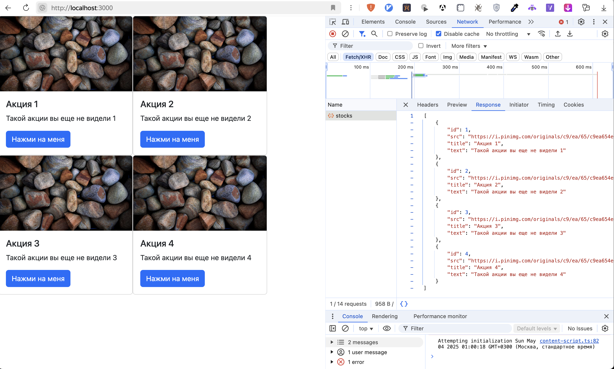
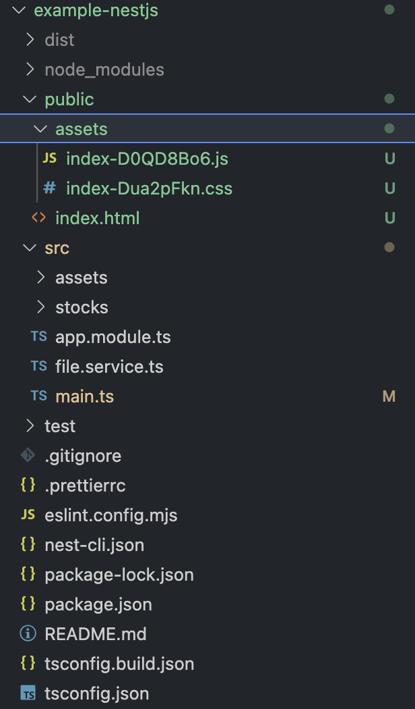

# ЛР №6. Сборка фронтенда. Раздача фронтенда в качестве статики.

## Цель

Разобраться, как осуществляется сборка клиентской части приложения. Добавить в бекенд приложение возможность раздачи клиентской части в качестве статики во избежание проблем с CORS.

## План

1. Сборка через `Vite`.
2. Раздача фронтенда в качестве статики.

## 1. Сборка через `vite`.

[Vite ](https://vite.dev/) - современная популярная система сборки для фронтенд приложений. [Добавим](https://vite.dev/guide/#manual-installation) `vite` в проект клиентской части с карточками (ЛР №3).

1. Перейдем в папку с фронтендом:

```bash
cd your-lab3-folder
```

2. Установим `vite`:

```bash
npm install -D vite
```

3. Добавим команды в `package.json`:

```json
// package.json
{
    "scripts": {
        "dev": "vite", // start dev server, aliases: `vite dev`, `vite serve`
        "build": "vite build", // build for production
        "preview": "vite preview" // locally preview production build
    }
}
```

4. Добавим `vite.config.js`:

```js
// vite.config.js
export default {
    build: {
        outDir: './public',
        emptyOutDir: true,
    },
};
```

Готово!

Выполним `npm run dev` и зайдем на `http://localhost:5173/`, чтобы убедиться, что все работает (бекенд должен быть предварительно запущен).


Выполнив `npm run build`, убедимся, что появляется папка `public` с собранной клиентской частью:


Также можно посмотреть превью сборки, выполнив команду `npm run preview`. В этом режиме фронтенд запускается в production-режиме, из результатов сборки в `public`.

Dev-режим (запуск через `vite` - ` npm run dev` или vs-code плагин`live-server`):


Preview-режим (запуск через `vite` - `npm run preview`):


## 2. Раздача фронтенда в качестве статики.

Если сейчас зайти на `http://localhost:3000/`, то ничего отображаться не будет и более того, будет ошибка:


Чтобы бекенд раздавал клиентскую часть в качестве статики нужно выполнить несколько действий:

1. Скопировать папку сборки `public` в проект с бекендом:
   

2. Указать при запуске NestJS сервера, что нужно раздавать содержимое `public` в качестве статики:

```ts
// main.ts
...
import { NestExpressApplication } from '@nestjs/platform-express';
import { resolve } from 'path';

async function bootstrap() {
  const app = await NestFactory.create<NestExpressApplication>(AppModule);

  app.useStaticAssets(resolve(__dirname, '..', 'public'));

  await app.listen(process.env.PORT ?? 3000);
}

...
```

-   `app.useStaticAssets(resolve(__dirname, '..', 'public'));` - указывает приложению путь к ассетам

-   Дополнительно нужно указать дженерик `NestExpressApplication` при создании экземляра приложения, чтобы ts понимал, что в качестве низкоуровневого фреймворка используется `express` (`useStaticAssets` как раз метод express-сервера)

Готово!

Если перезапустить NestJS сервер и зайти на `http://localhost:3000/`, можно убедиться, что теперь и карточки отображаются, и запросы выполняются и нет нужды обходить CORS, поскольку запросы выполняются с того же домена.


Итоговая структура приложения с бекендом из ЛР №4:


## Дополнительные материалы
